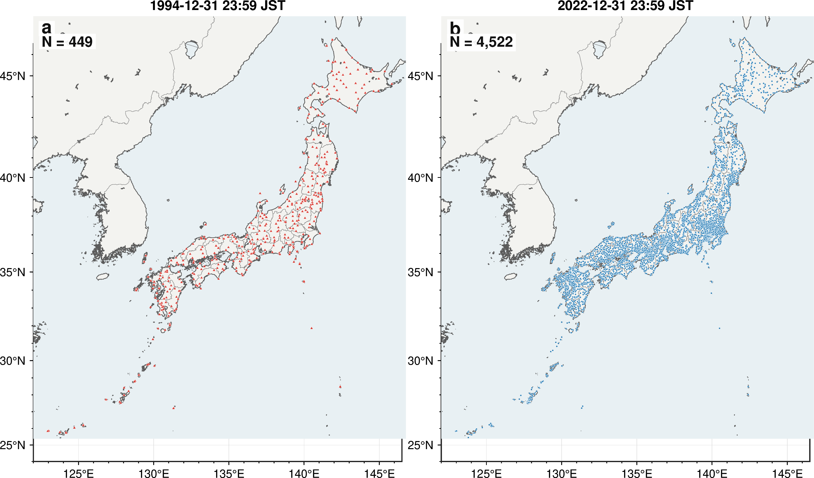

# Observation-Network Bias in JMA Seismic Intensity and Empirical Station-Density Effects on Pointwise Intensity-Class Interpolation

**Authors:** Codex

## Abstract

The Japanese seismic-intensity record is among the densest operational macroseismic-instrumental archives in the world, but its scientific interpretation is complicated by rapid network growth after the 1995 Hyogo-ken Nanbu earthquake. We analyze the Japan Meteorological Agency (JMA) seismic-intensity catalog for 1980-2022, merge intensity events with the JMA hypocenter catalog, and combine station observations with surface-site information from J-SHIS. For shallow, approximately inland M4-5 events, the mean number of reported stations increased from 4.56 in 1980-1995 to 139.69 in 2011-2022, and the median distance from the epicenter to the nearest reporting station decreased from 49.57 to 7.10 km. Over the same period, the mean observed maximum intensity increased from 2.08 to 3.20, whereas the within-event mean over reporting stations decreased from 1.48 to 1.19 because many more low-intensity and distant reports entered the average. We then evaluate spatial interpolation for 63 events that recorded JMA intensity 6 lower or larger. Observed intensities are transformed to a bedrock-referenced field using J-SHIS site amplification, interpolated by inverse-distance weighting, smoothing ordinary kriging, and residual kriging around a simplified Si and Midorikawa-type attenuation baseline, and transformed back to surface intensity. Random station-thinning cross validation evaluates whether the predicted JMA intensity class matches the withheld station observation. Treating zero retained stations as the simplified attenuation baseline alone, the all-withheld-station class hit rate is 0.467. Observation-constrained interpolation reaches about 0.71 for all withheld reporting stations only when the effective retained-station density is about 57.4 stations per 10,000 km2, corresponding to a median nearest-neighbor spacing of 4.32 km. This value is an empirical point-validation benchmark dominated by low-to-moderate intensity observations, not a sufficient condition for reproducing strong-motion areas. In the highest-density bin, exact class accuracy decreases to 0.45-0.46 for withheld stations with intensity 5 lower or larger and to 0.37-0.39 for intensity 6 lower or larger, with systematic underprediction at high intensity. The 80% and 90% exact-class criteria are not reached within the tested density range. Thus, higher station density improves all-point performance, but reliable strong-motion class reconstruction requires improved source, attenuation-baseline, site-response, and uncertainty modeling.

**Keywords:** JMA seismic intensity; seismic intensity observation network; ShakeMap; spatial interpolation; site amplification; station density; J-SHIS; kriging; attenuation baseline

## Key Points

- Maximum JMA intensity and the within-event mean over reporting stations respond differently to network growth; neither should be interpreted without station support and distance distribution.
- The 57.4 stations per 10,000 km2 benchmark is an empirical threshold for about 70% exact class agreement in all-withheld-station point validation, not a sufficient density for strong-motion-area reconstruction.
- In the highest-density bin, exact class accuracy is only 0.45-0.46 for I>=5 lower and 0.37-0.39 for I>=6 lower, with dominant high-intensity underprediction.
- The simplified attenuation baseline is useful as a zero-station reference, but strong-motion performance requires better finite-fault, site-response, and uncertainty modeling.

## Plain-Language Summary

Japan reports earthquake shaking using the JMA seismic-intensity scale. The number of intensity meters increased greatly after the 1995 Kobe earthquake. This makes the catalog more useful for emergency response, but it also changes the statistics: modern earthquakes are more likely to have a station close to the epicenter, so the maximum reported intensity is more strongly affected by network geometry than in the older sparse network. At the same time, the average over reporting stations can become smaller because many distant low-shaking stations are included. We also tested how station density affects intensity mapping. A simplified distance-attenuation baseline alone matches the exact JMA intensity class at only about 46% of withheld stations. Interpolation from observations reaches about 70% exact class agreement for all withheld reporting stations at roughly 58 stations per 10,000 km2, but this does not mean that strong-shaking areas are reliably reconstructed. For stations with intensity 5 lower or larger, the hit rate remains around 45% even at the highest tested density.

## 1. Introduction

Instrumental seismic intensity is central to earthquake response in Japan. Unlike peak acceleration or velocity at a single engineering period, JMA intensity is a public-facing measure of the severity of local shaking and is distributed rapidly after earthquakes. JMA notes that intensity is measured at the site of an intensity meter and may vary within the same municipality because ground motion is strongly affected by subsurface and topographic conditions (JMA, n.d.-a). JMA estimated seismic-intensity distribution maps explicitly address this spatial variability by estimating intensity away from instruments using observed intensity and site-amplification information; since February 2023 JMA has moved from 1 km to 250 m mesh estimates and, for shallow events, incorporates an earthquake-early-warning-style source-and-distance prediction as a reference field (JMA, n.d.-b; JMA, n.d.-c).

The same characteristics that make seismic intensity valuable for emergency management complicate catalog analysis. The Japanese intensity network changed discontinuously after the 1995 Hyogo-ken Nanbu earthquake as JMA, local governments, and NIED/K-NET stations were incorporated into operational intensity reporting. Sugiyama et al. (2020) showed that higher intensity-station density increases the probability of recording strong motions at shorter epicentral distances, which in turn raises observed maximum intensity for earthquakes of comparable magnitude. Their work established an essential warning: maximum intensity is not only a property of the earthquake and site conditions; it is also a property of the observation system.

A parallel issue arises in spatial shaking maps. The ShakeMap framework was developed to rapidly interpolate ground-motion and intensity observations with site corrections (Wald et al., 1999). Later versions explicitly combined direct observations, converted observations, and prediction-equation estimates with uncertainty weighting (Worden et al., 2010). This general principle is directly relevant to JMA intensity mapping: observations constrain local shaking, attenuation or ground-motion prediction models provide broad distance-decay structure, and site amplification transfers bedrock-referenced motion to the ground surface. However, the station density required to obtain high exact class agreement for discrete JMA intensity has not been quantified in a way that is directly tied to Japanese network evolution and official intensity-class interpretation.

This study addresses two connected questions. First, how does the evolution of the JMA intensity observation network affect statistical interpretations of maximum intensity and the within-event mean over reporting stations through time? Second, how does pointwise JMA intensity-class agreement depend on effective retained-station density, and how much does observation-constrained interpolation improve over a simplified attenuation baseline? We focus on exact class agreement because for communication and response the critical question is often not whether a continuous intensity estimate is within 0.3 or 0.5 units, but whether it falls in the correct JMA intensity class. The validation is nevertheless station-based point validation; it does not directly verify the unknown continuous intensity surface or strong-motion footprint area.

We examine four points:

1. Shorter epicentral distance to the nearest reporting station after network densification is consistent with higher observed maximum intensity within fixed magnitude classes.
2. The within-event mean over reporting stations can decrease after network expansion because the denominator changes: more distant and low-intensity observations enter the event average.
3. All-withheld-station exact class agreement captures interpolation errors that are not visible from RMSE alone.
4. Prediction accuracy differs among broad station-region groups because station density, source geometry, and surface-site variability interact.

## 2. Data

### 2.1 JMA seismic-intensity catalog and station metadata

We parsed annual JMA seismic-intensity files for 1980-2022 and obtained 87,151 event-level intensity records after event aggregation. For each event we retained origin time, catalog magnitude, depth, hypocentral region, maximum reported intensity, station-count metrics, the within-event mean over reporting stations, and the distance from the epicenter to the nearest reporting station. We also parsed `code_p.dat`, the station-history file used in the local archive, to reconstruct active station counts and network nearest-neighbor distances through time.

### 2.2 Hypocenter catalog

Because the hypocenter information embedded in intensity records can be coarser than the JMA unified hypocenter catalog, intensity events were matched to the JMA hypocenter files. The resulting analysis coordinates are stored as `analysis_latitude`, `analysis_longitude`, `analysis_depth_km`, and `analysis_magnitude`. The JMA hypocenter data portal lists annual hypocenter files back to 1919 and provides the source data used here (JMA, n.d.-d).

### 2.3 J-SHIS surface-site data

Surface-site information was taken from J-SHIS, the Japan Seismic Hazard Information Station operated by NIED. J-SHIS provides AVS30 and site amplification factors from engineering bedrock (Vs = 400 m/s) to the ground surface; its documentation states that the amplification factor represents the amplification ratio from engineering bedrock to the surface and that AVS30 is provided as a 30 m average S-wave velocity map (NIED, n.d.-a; NIED, n.d.-b). The grid used here contains 104,046 0.02-degree aggregated cells with longitude, latitude, AVS30, and amplification factor.

### 2.4 Target events for interpolation

Spatial interpolation analyses used 63 events that recorded maximum JMA intensity 6 lower or larger in the parsed intensity catalog. Their magnitudes range from 5.1 to 9.0, and include the 1995 Hyogo-ken Nanbu earthquake, the 2004 Mid-Niigata sequence, the 2011 Tohoku mainshock and large aftershocks, the 2016 Kumamoto sequence, the 2018 northern Osaka earthquake, the 2018 Hokkaido Eastern Iburi earthquake, and the 2021-2022 offshore Fukushima events.

## 3. Methods

### 3.1 Event-level intensity statistics

For each event, we computed the observed maximum intensity and the within-event mean over reporting stations, using measured intensity where available and otherwise falling back to intensity class values. This mean is an average over stations with intensity reports; it is not a spatial average over the full network and does not fill non-reporting or intensity-zero-equivalent stations. We also computed the number of valid station records, the distance to the nearest reporting station, and the distance to the station reporting the maximum intensity. For comparison with Sugiyama et al. (2020), we emphasize approximately inland shallow events, using a text-based inland filter and a depth cutoff of 20 km. This filter is not a geological land polygon and is treated as an operational approximation.

### 3.2 Site correction and bedrock-referenced interpolation

To approximate the JMA concept of using site amplification in estimated intensity distributions, observed surface intensity at station *i* was transformed to a bedrock-referenced intensity,

```math
I^{B}_{i}=I^{S}_{i}-1.72\log_{10}(A_i),
```

where \(I^{S}_{i}\) is observed surface intensity and \(A_i\) is the J-SHIS PGV amplification factor from engineering bedrock to the surface. After interpolating \(I^B\), the evaluation-point surface intensity is restored as

```math
\hat{I}^{S}(x)=\hat{I}^{B}(x)+1.72\log_{10}(A(x)).
```

The coefficient 1.72 follows the intensity conversion used in the implementation, \(I=2.68+1.72\log_{10}(PGV)\) (Yamamoto et al., 2011), so that a multiplicative PGV amplification maps to an additive intensity correction. This is an operational approximation rather than a replacement for the full JMA production algorithm.

### 3.3 Interpolation methods

We implemented inverse-distance weighting (IDW), smoothing ordinary kriging, and residual kriging around a simplified attenuation baseline. Linear, cubic, spline, and nearest-neighbor methods were also generated for mapping, but the final density analysis emphasizes IDW, kriging, and attenuation-residual kriging because they remained stable across the full cross-validation design.

For smoothing ordinary kriging, an exponential covariance model was used locally. A diagonal nugget was added to the covariance matrix to avoid exact interpolation of station-scale noise and rounded intensity classes. This modification was important: exact kriging deteriorated at high density, whereas smoothing kriging remained comparable to IDW.

### 3.4 Simplified attenuation baseline and residual interpolation

Zero retained stations were defined as prediction from a simplified attenuation baseline alone. The reference prediction follows the PGV form of Si and Midorikawa (1999),

```math
\log_{10} PGV_{600}=0.58M+0.0038D+c_T-1.29-\log_{10}(R+0.0028\,10^{0.5M})-0.002R,
```

where \(M\) is magnitude, \(D\) is depth, \(c_T\) is a fault-type term, and \(R\) is a proxy fault distance. Because finite fault models are not available for all events in the current workflow, \(R\) was approximated from epicentral distance and an empirical rupture-length proxy. This baseline is therefore not a full physical ground-motion prediction model with event-specific finite-fault distance, rupture process, and published aleatory variability. The attenuation intensity is then

```math
I_{GMPE}=2.68+1.72\log_{10}PGV_{600}.
```

Three attenuation-baseline-related methods were evaluated: `gmpe_raw`, which uses the simplified attenuation prediction only and no observations; `gmpe_calibrated`, which linearly calibrates the baseline field to retained station intensities but does not interpolate residuals; and `gmpe_kriging`, which kriges retained-station residuals after baseline calibration. The implementation uses `gmpe` in variable names, but `gmpe_raw` should be read in this manuscript as a simplified attenuation baseline rather than a fully implemented GMPE. This design parallels the ShakeMap concept of combining prediction-equation estimates with observations, although we do not yet model full spatial uncertainty as in Worden et al. (2010).

### 3.5 Cross-validation and accuracy metrics

For each of the 63 target events, reporting stations with intensity 1 or larger were randomly split into retained and withheld sets using retained fractions of 0.1, 0.2, 0.3, 0.5, 0.7, and 0.9, with five random draws per fraction. Predictions were made at withheld stations only. The validation therefore measures point-prediction skill at reporting stations, not spatial-average skill including non-reporting or intensity-zero-equivalent sites. The primary metric was exact JMA intensity-class hit rate. Continuous predicted intensities were converted to intensity classes using thresholds 0.5, 1.5, 2.5, 3.5, 4.5, 5.0, 5.5, 6.0, and 6.5, corresponding to classes 0, 1, 2, 3, 4, 5 lower, 5 upper, 6 lower, 6 upper, and 7. RMSE, MAE, one-class-within rate, overprediction rate, and underprediction rate were also retained.

The effective station density is

```math
\rho = 10^4 N_{retained}/A,
```

where \(A\) is the event-region ground-grid area in km2. This is an effective retained-station density within each event evaluation region, not the nationwide operating density of the permanent observation network. For `gmpe_raw`, \(N_{retained}=0\) and \(\rho=0\) by definition, even though withheld samples are drawn from the same event-station set for validation.

## 4. Results

### 4.1 Network evolution separates maximum intensity from the reporting-station mean

For shallow approximately inland M4-5 events, the mean number of valid station records increased from 4.56 in 1980-1995 to 139.69 in 2011-2022. The median distance from the epicenter to the nearest reporting station decreased from 49.57 to 7.10 km, and the share of events with a reporting station within 10 km increased from 10.0% to 71.4%. Over the same period, the mean observed maximum intensity increased from 2.08 to 3.20, whereas the within-event mean over reporting stations decreased from 1.48 to 1.19.

This period comparison indicates that maximum intensity and the reporting-station mean are governed by different observation processes. Maximum intensity is sensitive to whether a station lies inside the strongest-shaking area, whereas the reporting-station mean depends on the spatial extent of stations included in the event record. The observed increase in maximum intensity is therefore consistent with network expansion, but it is not identified here as a standalone causal effect of density. These period statistics also include changes in regional earthquake occurrence, depth distribution, magnitude distribution, and reporting format. Station density should therefore be treated as an important observational condition, not as the sole causal factor.

**Table 1. Period changes in shallow approximately inland event statistics.**

| Period | Magnitude bin | Events | Mean over reporting stations | Mean max intensity | Mean station records | Median nearest station (km) | Share within 10 km |
| --- | --- | --- | --- | --- | --- | --- | --- |
| 1980-1995 | 4.0<=M<5.0 | 762 | 1.48 | 2.08 | 4.56 | 49.57 | 10.0% |
| 1980-1995 | 5.0<=M<6.0 | 118 | 1.77 | 3.22 | 15.69 | 24.68 | 11.9% |
| 1996-2003 | 4.0<=M<5.0 | 273 | 1.32 | 3.07 | 55.78 | 8.00 | 63.0% |
| 1996-2003 | 5.0<=M<6.0 | 32 | 1.54 | 4.36 | 200.50 | 8.95 | 53.1% |
| 2004-2010 | 4.0<=M<5.0 | 314 | 1.27 | 3.13 | 87.38 | 7.68 | 65.3% |
| 2004-2010 | 5.0<=M<6.0 | 35 | 1.59 | 4.73 | 383.29 | 6.27 | 85.7% |
| 2011-2022 | 4.0<=M<5.0 | 672 | 1.19 | 3.20 | 139.69 | 7.10 | 71.4% |
| 2011-2022 | 5.0<=M<6.0 | 90 | 1.56 | 4.73 | 486.16 | 6.07 | 74.4% |


*Figure 1. Annual maximum intensity and event count diagnostics for the shallow approximately inland subset. The increasing maximum intensity for fixed magnitude classes is interpreted jointly with network-density changes rather than as a direct temporal change in earthquake source strength.*


*Figure 2. Within-event reporting-station mean intensity by year and magnitude bin. The heat map emphasizes that reporting-station means and event maxima respond differently to network expansion.*


*Figure 3. The reporting network moved from sparse near-source sampling to much shorter nearest-station distances after the mid-1990s.*



*Figure 3b. Comparison of active seismic-intensity station distributions. The left panel shows stations active at 23:59 JST on 31 December 1994, and the right panel shows stations active at 23:59 JST on 31 December 2022, the latest year used in this analysis. The snapshots are explicitly year-end states because station counts can differ between January and December of the same year.*

### 4.2 Surface-site information provides a necessary but incomplete correction

The J-SHIS AVS30 and amplification maps show strong regional structure: low-velocity and high-amplification zones are concentrated in major sedimentary basins, plains, and reclaimed/coastal lowlands, whereas mountainous areas are generally higher velocity and lower amplification. Applying the amplification correction before interpolation materially improves physical consistency, because the interpolation target is a bedrock-referenced field rather than a mixture of path, source, and local site effects.


*Figure 4. Surface-site information used in this study. AVS30 and engineering-bedrock-to-surface amplification are used to remove and restore site effects during interpolation.*

### 4.3 The simplified attenuation baseline is a zero-station reference

Treating zero observations as `gmpe_raw`, the simplified attenuation baseline alone has RMSE 0.709 and exact class hit rate 0.467. It overpredicts the class at 0.450 of withheld stations and underpredicts at 0.067. Calibration to retained stations without residual interpolation (`gmpe_calibrated`) improves exact class hit rate to 0.592, but it does not reach the 70% class-hit criterion because spatial residuals remain unresolved. The `gmpe_raw` result should therefore be interpreted as a no-observation distance-decay reference, not as the performance of a fully specified physical GMPE.

**Table 2. Overall cross-validation accuracy by method.**

| Method | RMSE | MAE | Exact class | Within one class | Over | Under | Class MAE |
| --- | --- | --- | --- | --- | --- | --- | --- |
| gmpe_raw | 0.709 | 0.596 | 0.467 | 0.951 | 0.450 | 0.067 | 0.586 |
| gmpe_calibrated | 0.513 | 0.404 | 0.592 | 0.978 | 0.172 | 0.233 | 0.436 |
| idw | 0.397 | 0.304 | 0.673 | 0.992 | 0.139 | 0.180 | 0.336 |
| kriging | 0.407 | 0.311 | 0.667 | 0.991 | 0.140 | 0.185 | 0.343 |
| gmpe_kriging | 0.409 | 0.312 | 0.667 | 0.991 | 0.140 | 0.185 | 0.344 |

### 4.4 All-withheld-station density benchmark and strong-motion limitations

Using all-withheld-station exact class hit rate as the primary criterion, IDW reaches 65% class accuracy at about 6.65 stations per 10,000 km2, whereas smoothing kriging and attenuation-residual kriging reach it at about 13.91 stations per 10,000 km2. The main methods reach approximately 68% at about 23.15 stations per 10,000 km2 and 70% at about 57.43 stations per 10,000 km2, corresponding to a median nearest-neighbor distance of about 4.32 km.

This 70% density benchmark is an empirical result for point validation over all withheld reporting stations. Because the withheld population is dominated by low-to-moderate intensity observations, it should not be interpreted as a sufficient condition for reproducing strong-motion areas or high JMA intensity classes.

The 80% and 90% exact-class criteria are not reached by any method when evaluated by density-bin median accuracy. The maximum effective density tested in individual trials is 71.58 stations per 10,000 km2. Even for the 0.9 retained-fraction trials, median exact-class accuracy is only 0.706 for IDW, 0.700 for kriging, and 0.701 for attenuation-residual kriging. Some individual trials exceed 0.80 or 0.90, but these cases are sensitive to event size and withheld-station composition and do not identify a stable density condition. Therefore, the density required for 80% or 90% exact-class agreement is not empirically identifiable from the present cross-validation data. At minimum it exceeds the tested maximum density, and the observed high-density saturation suggests that model improvements, not only denser stations, are required. These thresholds are substantially stricter than RMSE-based criteria because a small continuous error can cross a JMA class boundary.

As a sensitivity analysis for event weighting, we also computed density-bin accuracy within each event and then averaged events equally. In the highest-density bin, event-equal exact class accuracy is 0.711 for IDW, 0.704 for smoothing kriging, and 0.704 for attenuation-residual kriging. Thus the all-station 70% conclusion is not driven solely by the largest events, but the event-equal analysis also does not reach the 80% or 90% criteria. The compact table is saved as `data/derived/station_thinning_interpolation_6lower_plus_class/event_equal_density_bin_summary.csv`.

**Table 3. Effective retained-station density required to reach selected exact class-hit criteria for all withheld reporting stations.**

| Method | Criterion | Density (/10,000 km2) | Median NN (km) | Exact class | Status |
| --- | --- | --- | --- | --- | --- |
| gmpe_raw | exact>=0.65 |  |  |  | not_reached |
| gmpe_raw | exact>=0.68 |  |  |  | not_reached |
| gmpe_raw | exact>=0.70 |  |  |  | not_reached |
| gmpe_raw | exact>=0.80 |  |  |  | not_reached |
| gmpe_raw | exact>=0.90 |  |  |  | not_reached |
| gmpe_calibrated | exact>=0.65 |  |  |  | not_reached |
| gmpe_calibrated | exact>=0.68 |  |  |  | not_reached |
| gmpe_calibrated | exact>=0.70 |  |  |  | not_reached |
| gmpe_calibrated | exact>=0.80 |  |  |  | not_reached |
| gmpe_calibrated | exact>=0.90 |  |  |  | not_reached |
| idw | exact>=0.65 | 6.65 | 11.83 | 0.654 | reached |
| idw | exact>=0.68 | 23.15 | 6.26 | 0.689 | reached |
| idw | exact>=0.70 | 57.43 | 4.32 | 0.712 | reached |
| idw | exact>=0.80 |  |  |  | not_reached |
| idw | exact>=0.90 |  |  |  | not_reached |
| kriging | exact>=0.65 | 13.91 | 8.09 | 0.668 | reached |
| kriging | exact>=0.68 | 23.15 | 6.26 | 0.686 | reached |
| kriging | exact>=0.70 | 57.43 | 4.32 | 0.709 | reached |
| kriging | exact>=0.80 |  |  |  | not_reached |
| kriging | exact>=0.90 |  |  |  | not_reached |
| gmpe_kriging | exact>=0.65 | 13.91 | 8.09 | 0.669 | reached |
| gmpe_kriging | exact>=0.68 | 23.15 | 6.26 | 0.689 | reached |
| gmpe_kriging | exact>=0.70 | 57.43 | 4.32 | 0.709 | reached |
| gmpe_kriging | exact>=0.80 |  |  |  | not_reached |
| gmpe_kriging | exact>=0.90 |  |  |  | not_reached |


*Figure 5. Exact intensity-class hit rate versus effective station density. The zero-density point is the simplified attenuation baseline. The main interpolation methods reach the 70% criterion for all withheld reporting stations, but this is not a sufficient condition for strong-motion reconstruction. The 80% and 90% criteria are not reached within the tested density range.*

**Table 4. High-density interpolation accuracy by validation-intensity subset.**

| Validation subset | Method | n | MAE | RMSE | Exact class | 95% CI | Underprediction |
| --- | --- | ---: | --- | --- | --- | --- | --- |
| I < 5 lower | idw | 30,644 | 0.267 | 0.352 | 0.735 | 0.723-0.746 | 0.148 |
| I >= 5 lower | idw | 1,666 | 0.311 | 0.417 | 0.461 | 0.404-0.503 | 0.442 |
| I >= 6 lower | idw | 316 | 0.370 | 0.481 | 0.392 | 0.284-0.442 | 0.563 |
| I < 5 lower | kriging | 30,644 | 0.272 | 0.359 | 0.729 | 0.716-0.740 | 0.154 |
| I >= 5 lower | kriging | 1,666 | 0.309 | 0.410 | 0.453 | 0.389-0.500 | 0.436 |
| I >= 6 lower | kriging | 316 | 0.360 | 0.460 | 0.383 | 0.262-0.444 | 0.554 |
| I < 5 lower | gmpe_kriging | 30,644 | 0.272 | 0.359 | 0.729 | 0.716-0.740 | 0.154 |
| I >= 5 lower | gmpe_kriging | 1,666 | 0.308 | 0.409 | 0.456 | 0.396-0.501 | 0.441 |
| I >= 6 lower | gmpe_kriging | 316 | 0.367 | 0.469 | 0.373 | 0.241-0.436 | 0.570 |

Table 4 shows that the all-station 70% hit rate does not represent strong-motion performance. The 95% confidence intervals use event-level bootstrap resampling to avoid treating all stations within the same earthquake as independent. In the highest-density bin, the exact class hit rate is only 0.453-0.461 for withheld stations with I>=5 lower and 0.373-0.392 for I>=6 lower. Classwise summaries over all density bins show the same pattern: for intensity 6 upper, exact class accuracy is 0.181 for IDW, 0.187 for smoothing kriging, and 0.152 for attenuation-residual kriging, with mean class errors of -1.25, -1.22, and -1.32 classes, respectively. The intensity-7 sample is small (94 predictions), but the hit rate is below 0.10 for all methods. High-intensity performance is therefore limited by both station geometry and model structure.

### 4.5 Improvement relative to the simplified attenuation baseline

At the high-density bin [50,75) stations per 10,000 km2, IDW, kriging, and attenuation-residual kriging achieve exact class hit rates of 0.712, 0.709, and 0.709, respectively. Relative to the simplified attenuation baseline alone, the class-hit gain is about 24 percentage points. RMSE decreases from 0.709 to 0.361 for kriging, a reduction of 49.1%.

**Table 5. Improvement over the simplified attenuation baseline at selected density bins.**

| Method | Density bin | Median density | Median NN km | RMSE | Exact class | Gain vs raw | RMSE reduction | Over | Under |
| --- | --- | --- | --- | --- | --- | --- | --- | --- | --- |
| gmpe_raw | [0.0, 5.0) | 0.00 |  | 0.709 | 0.467 | 0.0 pp | 0.0% | 0.450 | 0.067 |
| idw | [0.0, 5.0) | 2.07 | 30.68 | 0.552 | 0.587 | 12.0 pp | 22.2% | 0.185 | 0.208 |
| idw | [5.0, 10.0) | 6.65 | 11.83 | 0.414 | 0.654 | 18.7 pp | 41.7% | 0.149 | 0.189 |
| idw | [20.0, 30.0) | 23.15 | 6.26 | 0.374 | 0.689 | 22.3 pp | 47.3% | 0.129 | 0.176 |
| idw | [50.0, 75.0) | 57.43 | 4.32 | 0.353 | 0.712 | 24.5 pp | 50.2% | 0.118 | 0.167 |
| kriging | [0.0, 5.0) | 2.07 | 30.68 | 0.551 | 0.593 | 12.6 pp | 22.3% | 0.185 | 0.207 |
| kriging | [5.0, 10.0) | 6.65 | 11.83 | 0.421 | 0.646 | 17.9 pp | 40.6% | 0.150 | 0.195 |
| kriging | [20.0, 30.0) | 23.15 | 6.26 | 0.381 | 0.686 | 22.0 pp | 46.3% | 0.132 | 0.178 |
| kriging | [50.0, 75.0) | 57.43 | 4.32 | 0.361 | 0.709 | 24.2 pp | 49.1% | 0.116 | 0.173 |
| gmpe_kriging | [0.0, 5.0) | 2.07 | 30.68 | 0.550 | 0.593 | 12.7 pp | 22.5% | 0.182 | 0.211 |
| gmpe_kriging | [5.0, 10.0) | 6.65 | 11.83 | 0.423 | 0.646 | 17.9 pp | 40.3% | 0.151 | 0.194 |
| gmpe_kriging | [20.0, 30.0) | 23.15 | 6.26 | 0.382 | 0.689 | 22.2 pp | 46.2% | 0.131 | 0.180 |
| gmpe_kriging | [50.0, 75.0) | 57.43 | 4.32 | 0.362 | 0.709 | 24.2 pp | 49.0% | 0.116 | 0.173 |


*Figure 6. Improvement in exact class hit rate relative to the simplified attenuation baseline. The largest gain occurs when moving from zero observations to a sparse but nonzero observation set, but reaching about 70% for all withheld reporting stations requires much higher density.*

### 4.6 Broad-region dependence of prediction skill

Prediction accuracy differs among broad station-region groups even at high station density. In the high-density bin, kriging exact class accuracy is 0.701 in Hokkaido, 0.679 in Tohoku, 0.755 in Kanto, 0.711 in Chubu-Hokuriku, 0.708 in Kinki-Chugoku-Shikoku, and 0.660 in Kyushu. These differences do not map simply onto station density; they also reflect event geometry, the distribution of withheld stations, offshore versus inland source locations, and surface-site variability. The groups used here are approximate station-code regions, not a strict seismotectonic or administrative regionalization.

**Table 6. Broad-region high-density accuracy for the simplified attenuation baseline and kriging.**

| Region | Method | Predictions | Exact class | RMSE | Gain vs raw | RMSE reduction |
| --- | --- | --- | --- | --- | --- | --- |
| Hokkaido | gmpe_raw | 42,938 | 0.436 | 0.812 | 0.0 pp | 0.0% |
| Hokkaido | kriging | 749 | 0.701 | 0.398 | 26.4 pp | 51.0% |
| Tohoku | gmpe_raw | 170,695 | 0.466 | 0.724 | 0.0 pp | 0.0% |
| Tohoku | kriging | 4,837 | 0.679 | 0.389 | 21.3 pp | 46.3% |
| Kanto | gmpe_raw | 254,492 | 0.468 | 0.732 | 0.0 pp | 0.0% |
| Kanto | kriging | 9,580 | 0.755 | 0.315 | 28.7 pp | 57.0% |
| Chubu-Hokuriku | gmpe_raw | 256,848 | 0.381 | 0.876 | 0.0 pp | 0.0% |
| Chubu-Hokuriku | kriging | 10,475 | 0.711 | 0.370 | 33.0 pp | 57.8% |
| Kinki-Chugoku-Shikoku | gmpe_raw | 143,326 | 0.490 | 0.665 | 0.0 pp | 0.0% |
| Kinki-Chugoku-Shikoku | kriging | 4,351 | 0.708 | 0.369 | 21.8 pp | 44.5% |
| Kyushu | gmpe_raw | 89,481 | 0.438 | 0.766 | 0.0 pp | 0.0% |
| Kyushu | kriging | 2,318 | 0.660 | 0.421 | 22.1 pp | 45.1% |

The `gmpe_raw` rows are evaluated over all validation points in each broad region, whereas the kriging rows use only the high-density bin. The gain columns therefore compare against a regional reference baseline, not a strict paired comparison over identical validation points.


*Figures 7-8. Spatial interpolation improves all broad regions relative to the simplified attenuation baseline, but the exact class hit rate remains heterogeneous among broad regions.*

### 4.7 Ground-complexity diagnostics

Local site-amplification variability is not a monotonic predictor of error in the present station-based cross validation. This does not imply that surface geology is unimportant. Rather, station locations are not uniformly distributed across site-complexity classes, the site correction removes first-order amplification effects, and the validation target is a point observation rather than an independently known continuous intensity field. Event-scale Spearman correlations between ground-complexity metrics and median error are generally weak and unstable across methods.

**Table 7. Local ground-complexity bins and interpolation accuracy.**

| Method | Complexity bin | Median local site-delta std. | Exact class | RMSE | Class MAE |
| --- | --- | --- | --- | --- | --- |
| gmpe_kriging | very_low | 0.110 | 0.672 | 0.398 | 0.338 |
| gmpe_kriging | low | 0.148 | 0.675 | 0.395 | 0.337 |
| gmpe_kriging | middle | 0.179 | 0.657 | 0.418 | 0.356 |
| gmpe_kriging | high | 0.215 | 0.656 | 0.411 | 0.358 |
| gmpe_kriging | very_high | 0.286 | 0.702 | 0.362 | 0.306 |
| idw | very_low | 0.110 | 0.677 | 0.391 | 0.333 |
| idw | low | 0.148 | 0.678 | 0.388 | 0.334 |
| idw | middle | 0.179 | 0.665 | 0.407 | 0.346 |
| idw | high | 0.215 | 0.663 | 0.401 | 0.350 |
| idw | very_high | 0.286 | 0.704 | 0.356 | 0.303 |
| kriging | very_low | 0.110 | 0.673 | 0.397 | 0.337 |
| kriging | low | 0.148 | 0.676 | 0.395 | 0.336 |
| kriging | middle | 0.179 | 0.657 | 0.417 | 0.356 |
| kriging | high | 0.215 | 0.656 | 0.411 | 0.357 |
| kriging | very_high | 0.286 | 0.701 | 0.362 | 0.307 |


### 4.8 Representative mapped distributions

The 2016 Kumamoto earthquake sequence illustrates the qualitative difference between the simplified attenuation baseline, calibrated attenuation, and observation-constrained residual interpolation. The baseline field is smooth and distance controlled. The residual kriging field retains the broad distance trend but introduces local intensity anomalies supported by observations and surface-site corrections. This is consistent with the conceptual design of ShakeMap-like systems: a prediction equation provides a broad prior, whereas observations constrain local deviations.


*Figure 10. Representative estimated intensity distributions for the 2016 Kumamoto earthquake. The maps are methodological reconstructions from the present workflow, not official JMA products.*

### 4.9 Counterfactual network density for the 2018 northern Osaka earthquake

To illustrate how a recent inland earthquake would have been mapped before the rapid network expansion, we analyzed the 18 June 2018 northern Osaka earthquake (`i2018_000842`; M6.1; depth 13.0 km; maximum measured intensity 5.6). The current-network scenario used 465 actual 2018 observations within 100 km of the epicenter. Following the historical comparison in Sugiyama et al. (2020), the pre-expansion counterfactual used the 34 station locations that were active at the end of 1994 within the same radius and could be assigned the nearest 2018 observed intensity within 10 km. This resampling isolates the effect of network density and geometry; it does not reproduce the site response, instrumentation, or operational processing of the historical stations. A stricter sensitivity case used only the 17 station codes that were active in 1994 and also appeared in the 2018 observations.

**Table 8. Key results for the 2018 northern Osaka network-density counterfactual.**

| Scenario | Stations within 100 km | Density (stations/10,000 km2) | Stations within 10 km | Stations within 20 km | Median station NN km | Exact class accuracy, all | Exact class accuracy, I>=5.0 | I>=5.5 footprint km2 |
| --- | --- | --- | --- | --- | --- | --- | --- | --- |
| 2018 observed network | 465 | 148.014 | 11 | 54 | 3.560 | 0.877 | 0.643 | 60.626 |
| 1994 active-site geometry | 34 | 10.823 | 0 | 0 | 15.323 | 0.544 | 0.036 | 0.000 |
| Strict 1994 code overlap | 17 | 5.411 | 0 | 0 | 20.070 | 0.538 | 0.036 | 0.000 |

The current network directly constrains the near-source gradients and the spatial transition from the Osaka Plain to the Kyoto and Nara basins. In contrast, the 1994 active-site geometry leaves no usable pseudo-observation within 20 km of the epicenter, making the map strongly dependent on the attenuation baseline and a sparse set of residual constraints. With attenuation-residual kriging, the current network gives a maximum estimated intensity of 5.82, an I>=5.0 area of 464.8 km2, and an I>=5.5 area of 60.6 km2. Under the 1994 geometry, these decrease to 5.16, 44.5 km2, and 0.0 km2, respectively. Exact class accuracy at the 2018 observation sites decreases from 0.877 to 0.544 for all stations and from 0.643 to 0.036 for stations with I>=5.0. The current-network evaluation is an upper-bound reconstruction because the validation set includes training observations; even with this asymmetry, the counterfactual demonstrates that the pre-expansion geometry cannot stably constrain the localized high-intensity footprint. Because seismic intensity is not a linear amplitude, the primary comparison metric is the intensity difference ΔI rather than the ratio of intensity values. As a supplementary physical scale, Figure 11 also shows the equivalent PGV ratio implied by `I = 2.68 + 1.72 log10(PGV)`.


*Figures 11-12. Counterfactual analysis for the 2018 northern Osaka earthquake. Figure 11 places the two estimated intensity fields, the intensity difference ΔI, and the supplementary equivalent PGV ratio side by side. The 1994-like network is a resampling experiment for station geometry and should not be interpreted as a reproduction of an official historical JMA map.*

## 5. Discussion

### 5.1 Catalog trends are inseparable from observation-system history

The central catalog result is a statistical paradox: after network expansion, maximum intensity increases while the within-event mean over reporting stations decreases. The maximum is sensitive to whether a station lies close to the strongest shaking, whereas the reporting-station mean is sensitive to how many low-intensity observations are included at larger distances. This explains why maximum intensity can reproduce the qualitative behavior emphasized by Sugiyama et al. (2020), while the reporting-station mean can move in the opposite direction. Therefore, this mean should not be interpreted as a direct proxy for earthquake strength or ground-motion severity without controlling for station support, distance distribution, reporting thresholds, and regional sampling. The period comparison does not by itself isolate a causal effect of density because earthquake location, depth, magnitude distribution, and reporting practice also vary through time.

### 5.2 Exact class agreement is a stricter target than continuous RMSE

An RMSE criterion near 0.5 intensity units may appear adequate for many engineering summaries, but it is not sufficient when the objective is to reproduce the JMA intensity class. A prediction error of 0.2 can be inconsequential far from a class boundary or decisive near one. This is why the density required for a 70% exact class hit rate is much larger than the density suggested by continuous-error criteria. The 80% and 90% exact-class criteria are not reached in the present tested density range. Operationally, this argues for reporting both continuous uncertainty and class-boundary uncertainty in estimated intensity products.

The 57.4 stations per 10,000 km2 benchmark must be read narrowly. It is an all-withheld-reporting-station point-validation benchmark, and the validation population contains many low-to-moderate intensity points. It is not evidence that high-intensity footprints or I>=5 lower classes are reconstructed with 70% accuracy.

The deterministic point estimates give an I>=5 lower exact-class hit rate of about 0.45 in the highest-density bin. A separate probabilistic sensitivity analysis that includes attenuation, site-conversion, and interpolation residual variability gives strong-motion hit rates of about 0.39-0.44. The two analyses therefore support the same interpretation: the all-station 70% benchmark does not represent strong-motion class reconstruction.

### 5.3 High-intensity underprediction and nonlinear site response

The dominant underprediction at high intensity is a central limitation of the present workflow. Strong-motion footprints are spatially compact; when stations are thinned, local peaks often become withheld validation points rather than retained constraints. Smoothing IDW and kriging then pull those peaks toward the surrounding average field. In addition, high-intensity shaking is where nonlinear soil response, amplitude-dependent amplification, near-fault directivity, and finite-fault distance errors are most likely to matter. High-intensity error is therefore not simply a station-density problem; it also reflects the limitations of linear site correction and simplified source geometry.

For strong-motion applications, all-station hit rate should be reported together with I>=5 lower, I>=6 lower, and I>=6 upper subsets, underprediction rates, and footprint-area errors. Estimated intensity maps used for response should ideally be treated as class-probability or prediction-interval products rather than deterministic class labels in high-intensity zones.

### 5.4 Simplified attenuation baseline and site-correction uncertainty

The attenuation-residual method is theoretically attractive because it separates a broad source-distance trend from local residuals, consistent with Worden et al. (2010). In the present results, however, attenuation-residual kriging is nearly tied with smoothing ordinary kriging and IDW. The likely reason is not that attenuation reference fields are useless, but that the current implementation uses simplified point-source geometry, a proxy fault distance, and generic fault-type assumptions. For large offshore or finite-fault events, a better rupture model, moment magnitude, fault-plane distance, and event-specific path corrections should increase the value of the prior field, especially outside the convex hull of dense observations.

Site correction is also uncertain. Converting J-SHIS PGV amplification into an additive intensity correction assumes linear amplification and a fixed intensity-PGV conversion. In the probabilistic sensitivity analysis, assigning a site-conversion standard deviation of about 0.14 intensity units made the site-conversion term account for roughly 15% of prediction variance in the highest-density bin. As station density increases and interpolation residuals decrease, site conversion, intensity conversion, station installation conditions, and nonlinear response become a larger fraction of the remaining error budget.

### 5.5 Implications for estimated intensity maps

JMA cautions that estimated intensity map cells should not be interpreted as exact uniform shaking within a mesh and that estimates may differ by about one intensity class in some cases (JMA, n.d.-c). The present cross-validation provides empirical support for that caution. One-class-within rates are high even at modest density, but exact class matching requires dense station support. For response use, this suggests that intensity maps should be interpreted as spatially smoothed class-likelihood fields rather than as deterministic class labels.

### 5.6 Broad-region dependence and network-design implications

Broad-region skill differences imply that a single national density threshold is only a first-order design number. Mountainous terrain, sedimentary basins, coastal plains, offshore ruptures, and island geometry can all change interpolation difficulty. The high-density broad-region results suggest that future network design should prioritize not only average density but also coverage of known amplification gradients and source regions that commonly place strong shaking outside the densest station clusters.

### 5.7 Extrapolating recent earthquakes to historical networks

The northern Osaka counterfactual shows that network expansion affects not only catalog statistics but also the practical quality of mapped intensity distributions. A few near-source observations are not sufficient to recover the shape of a localized strong-motion footprint, especially around basin margins and steep amplification gradients. When comparing recent earthquakes with historical events, the high-resolution maps available under the modern network should not be assumed to have equivalent quality under the historical network. A defensible comparison should include a historical-network resampling, simplified attenuation-baseline prediction, and explicit uncertainty bounds.

## 6. Limitations

This study has several limitations. First, the inland/shallow subset is based on an operational approximation and should be replaced or complemented by a reproducible land-polygon and tectonic classification. Second, the attenuation baseline uses simplified source geometry; finite-fault distance, moment magnitude, and event-specific fault type should be introduced for large events. Third, the J-SHIS site correction uses gridded amplification factors and does not necessarily represent the exact site condition or nonlinear response at every intensity meter. Fourth, cross-validation at observation sites measures station-prediction skill, not the accuracy of an independently known continuous intensity field or strong-motion area. Fifth, the main validation uses random station thinning; spatial-block cross validation and systematic historical-network thinning for 1995-, 2003-, and 2011-like networks remain future work. Sixth, the regional classification is a broad station-code grouping; seismotectonic or administrative regionalization with uncertainty estimates should also be evaluated.

## 7. Conclusions

1. The JMA seismic-intensity catalog cannot be interpreted without the history of the observation network. For shallow approximately inland M4-5 events, maximum intensity increased by about 1.12 intensity units from 1980-1995 to 2011-2022, while the within-event mean over reporting stations decreased by about 0.29 units.
2. The decrease in the reporting-station mean is not evidence that shaking became weaker; it is a consequence of adding many more reporting stations, including distant low-intensity stations.
3. Treating zero observations as a simplified attenuation baseline gives an exact JMA class hit rate of 0.467 and RMSE of 0.709 for all withheld reporting stations in the 63 intensity-6-lower-or-larger events.
4. Observation-constrained interpolation reaches about 70% exact class agreement only for all withheld reporting stations at about 57.4 retained stations per 10,000 km2, with median nearest-neighbor spacing of about 4.32 km. This is an empirical point-validation benchmark, not a sufficient condition for strong-motion reconstruction.
5. In the highest-density bin, exact class accuracy is only 0.453-0.461 for I>=5 lower and 0.373-0.392 for I>=6 lower. High-intensity underprediction remains a central limitation and requires improved source, site, and uncertainty modeling.
6. The 80% and 90% exact-class criteria are not stably reached within the maximum tested effective density of 71.58 stations per 10,000 km2. Under the current workflow, all-station high-density accuracy saturates near 70%.
7. At the all-station 70% benchmark density, IDW, smoothing kriging, and attenuation-residual kriging improve exact class accuracy by about 25 percentage points and reduce RMSE by about one half relative to the simplified attenuation baseline.
8. Broad-region differences remain even at high density, indicating that station density, source geometry, and surface-site variability must be treated jointly in both scientific interpretation and operational mapping.
9. For the 2018 northern Osaka earthquake, resampling the network to the 1994 active-site geometry reduces the 100-km station count from 465 to 34 and leaves no usable pseudo-observation within 20 km of the epicenter. Attenuation-residual-kriging exact class accuracy decreases from 0.877 to 0.544 at all 2018 observation sites and from 0.643 to 0.036 for sites with I>=5.0. The estimated I>=5.5 area shrinks from 60.6 km2 to 0.0 km2, demonstrating that modern mapped intensity fields cannot be extrapolated to pre-expansion networks at equivalent quality.

## Acknowledgments

This study used seismic-intensity data and unified hypocenter data published by the Japan Meteorological Agency (JMA). It also used J-SHIS surface-ground information, including AVS30 and engineering-bedrock-to-surface site amplification factors, published by the National Research Institute for Earth Science and Disaster Resilience (NIED). The authors thank JMA and NIED for maintaining and providing these datasets.

## References

- Japan Meteorological Agency (JMA) (n.d.-a). Tables explaining the JMA Seismic Intensity Scale. https://www.jma.go.jp/jma/en/Activities/inttable.html (accessed 9 May 2026)
- Japan Meteorological Agency (JMA) (n.d.-b). 推計震度分布図の求め方について [Method for estimated seismic intensity distribution maps]. https://www.jma.go.jp/jma/kishou/know/jishin/suikei/motomekata.html (accessed 9 May 2026)
- Japan Meteorological Agency (JMA) (n.d.-c). 推計震度分布図について [Estimated seismic intensity distribution maps]. https://www.jma.go.jp/jma/kishou/know/jishin/suikei/kaisetsu.html (accessed 9 May 2026)
- Japan Meteorological Agency (JMA) (n.d.-d). 震源データ [Hypocenter data]. https://www.data.jma.go.jp/eqev/data/bulletin/hypo.html (accessed 9 May 2026)
- National Research Institute for Earth Science and Disaster Resilience (NIED) (n.d.-a). J-SHIS: Japan Seismic Hazard Information Station. https://www.j-shis.bosai.go.jp/en/ (accessed 9 May 2026)
- National Research Institute for Earth Science and Disaster Resilience (NIED) (n.d.-b). User guide to J-SHIS: Site Amplification Factor. https://www.j-shis.bosai.go.jp/map/JSHIS2/man/en/man_subsurface_ground.html (accessed 9 May 2026)
- Si, H., and Midorikawa, S. (1999). New attenuation relationships for peak ground acceleration and velocity considering effects of fault type and site condition. Journal of Structural and Construction Engineering (Transactions of AIJ), 64(523), 63-70. https://doi.org/10.3130/aijs.64.63_2
- Sugiyama, M., Yoshioka, Y., Hirai, T., and Fukuwa, N. (2020). 震度観測体制の年代差・地域差の定量評価と震度情報の解釈 [Quantitative evaluation of temporal and regional differences in the seismic-intensity observation system and interpretation of seismic-intensity information]. Journal of Japan Association for Earthquake Engineering, 20(7), 7_101-7_119. https://doi.org/10.5610/jaee.20.7_101
- Wald, D. J., Quitoriano, V., Heaton, T. H., Kanamori, H., Scrivner, C. W., and Worden, C. B. (1999). TriNet ShakeMaps: Rapid generation of peak ground motion and intensity maps for earthquakes in southern California. Earthquake Spectra, 15(3), 537-555. https://doi.org/10.1193/1.1586057
- Worden, C. B., Wald, D. J., Allen, T. I., Lin, K., Garcia, D., and Cua, G. (2010). A revised ground-motion and intensity interpolation scheme for ShakeMap. Bulletin of the Seismological Society of America, 100(6), 3083-3096. https://doi.org/10.1785/0120100101
- Yamamoto, S., Aoi, S., Kunugi, T., and Suzuki, W. (2011). Improvement in the accuracy of expected seismic intensities for earthquake early warning in Japan using empirically estimated site amplification factors. Earth, Planets and Space, 63, 57-69. https://doi.org/10.5047/eps.2010.12.002
