# Observation-Network Bias and Station-Density Requirements for Class-Preserving Interpolation of JMA Seismic Intensity

**Authors:** Mitsuki Sugiyama [affiliation, ORCID, and corresponding author information to be inserted]

## Abstract

The Japanese seismic-intensity record is among the densest operational macroseismic-instrumental archives in the world, but its scientific interpretation is complicated by rapid network growth after the 1995 Hyogo-ken Nanbu earthquake. We analyze the Japan Meteorological Agency (JMA) seismic-intensity catalog for 1980-2022, merge intensity events with the JMA hypocenter catalog, and combine station observations with surface-site information from J-SHIS. We first quantify how observation-network evolution changes event-level intensity statistics. For shallow, approximately inland M4-5 events, the mean number of reported stations increased from 4.56 in 1980-1995 to 139.69 in 2011-2022, and the median distance from the epicenter to the nearest reporting station decreased from 49.57 to 7.10 km. Over the same period, the mean observed maximum intensity increased from 2.08 to 3.20, whereas the event mean station intensity decreased from 1.48 to 1.19 because many more low-intensity and distant stations entered the average. We then evaluate spatial interpolation for 22 events that recorded JMA intensity 6 upper or 7. Observed intensities are transformed to a bedrock-referenced field using J-SHIS site amplification, interpolated by inverse-distance weighting, smoothing ordinary kriging, and a GMPE-residual approach, and transformed back to surface intensity. Cross validation is performed by randomly withholding stations and evaluating whether the predicted JMA intensity class exactly matches the withheld observation. Treating zero retained stations as attenuation-only prediction, the exact class hit rate is 0.455 for the Si and Midorikawa-type attenuation reference alone. Observation-constrained interpolation reaches about 0.703 only when the effective retained-station density is about 57.7 stations per 10,000 km2, corresponding to a median nearest-neighbor spacing of 4.35 km. The 80% and 90% exact-class criteria are not reached within the tested density range. Thus, exact-class accuracy above 80% cannot be obtained by density increase alone in the present workflow; improved source, path, site, and uncertainty modeling is required. The improvement relative to attenuation-only prediction is about +25 percentage points in class hit rate and about 51-52% in RMSE. Regional analyses show that prediction skill remains spatially heterogeneous even at high density, indicating that station density, event geometry, and surface-site variability must be considered jointly when interpreting intensity maps and catalog trends.

**Keywords:** JMA seismic intensity; seismic intensity observation network; ShakeMap; spatial interpolation; site amplification; station density; J-SHIS; kriging; ground-motion prediction equation

## Key Points

- The apparent increase in maximum JMA intensity after 1995 is strongly coupled to station-density growth and shorter epicentral distances, whereas event mean station intensity can decrease because additional distant low-intensity stations enter the average.
- For class-preserving interpolation of JMA intensity, approximately 57.7 retained stations per 10,000 km2, or a median nearest-neighbor spacing of 4.35 km, is required to reach a 70% exact class hit rate in the present cross-validation design.
- The 80% and 90% exact-class criteria are not reached within the tested range; at the high-density bin [50,75) stations per 10,000 km2, the main interpolation methods saturate near 70%.
- Attenuation-only intensity prediction is not a competitive substitute for local observations: observation-constrained interpolation improves exact class hit rate by about 25 percentage points and reduces RMSE by about one half at high density.

## Plain-Language Summary

Japan reports earthquake shaking using the JMA seismic-intensity scale. The number of intensity meters increased greatly after the 1995 Kobe earthquake. This makes the catalog more useful for emergency response, but it also changes the statistics: modern earthquakes are more likely to have a station close to the epicenter, so the maximum reported intensity tends to be larger than it would have been under the older sparse network. At the same time, average intensity across all reporting stations can become smaller because many distant low-shaking stations are included. We also tested how dense the network must be to map intensity reliably. If no stations are used, a distance-attenuation model alone matches the exact JMA intensity class at only about 46% of withheld stations. With interpolation from observations, about 58 stations per 10,000 km2 are needed to reach a 70% exact class match. The 80% and 90% exact-match levels are not reached in the tested density range. The remaining errors differ by region, showing that dense stations, site conditions, and earthquake geometry all matter.

## 1. Introduction

Instrumental seismic intensity is central to earthquake response in Japan. Unlike peak acceleration or velocity at a single engineering period, JMA intensity is a public-facing measure of the severity of local shaking and is distributed rapidly after earthquakes. JMA notes that intensity is measured at the site of an intensity meter and may vary within the same municipality because ground motion is strongly affected by subsurface and topographic conditions (JMA, n.d.-a). JMA estimated seismic-intensity distribution maps explicitly address this spatial variability by estimating intensity away from instruments using observed intensity and site-amplification information; since February 2023 JMA has moved from 1 km to 250 m mesh estimates and, for shallow events, incorporates an earthquake-early-warning-style source-and-distance prediction as a reference field (JMA, n.d.-b; JMA, n.d.-c).

The same characteristics that make seismic intensity valuable for emergency management complicate catalog analysis. The Japanese intensity network changed discontinuously after the 1995 Hyogo-ken Nanbu earthquake as JMA, local governments, and NIED/K-NET stations were incorporated into operational intensity reporting. Sugiyama et al. (2020) showed that higher intensity-station density increases the probability of recording strong motions at shorter epicentral distances, which in turn raises observed maximum intensity for earthquakes of comparable magnitude. Their work established an essential warning: maximum intensity is not only a property of the earthquake and site conditions; it is also a property of the observation system.

A parallel issue arises in spatial shaking maps. The ShakeMap framework was developed to rapidly interpolate ground-motion and intensity observations with site corrections (Wald et al., 1999). Later versions explicitly combined direct observations, converted observations, and prediction-equation estimates with uncertainty weighting (Worden et al., 2010). This general principle is directly relevant to JMA intensity mapping: observations constrain local shaking, ground-motion prediction equations (GMPEs) provide broad distance-decay structure, and site amplification transfers bedrock-referenced motion to the ground surface. However, the observation density required to preserve discrete JMA intensity classes has not been quantified in a way that is directly tied to Japanese network evolution and official intensity-class interpretation.

This study addresses two connected questions. First, how does the evolution of the JMA intensity observation network affect statistical interpretations of mean and maximum intensity through time? Second, how many observations are needed before spatial interpolation of JMA intensity becomes sufficiently reliable, and how much does interpolation improve over a distance-attenuation prediction alone? We focus on class-preserving accuracy because for communication and response the critical question is often not whether a continuous intensity estimate is within 0.3 or 0.5 units, but whether it falls in the correct JMA intensity class.

We frame the study around four hypotheses:

1. Network densification increases observed maximum intensity for fixed magnitude classes by reducing the distance to the nearest reporting station.
2. Event mean station intensity can decrease after network expansion because the denominator changes: more distant and low-intensity observations enter the event average.
3. Class-preserving interpolation requires a much higher station density than RMSE-based criteria suggest.
4. Prediction accuracy is regionally variable because station density, source geometry, and surface-site variability interact.

## 2. Data

### 2.1 JMA seismic-intensity catalog and station metadata

We parsed annual JMA seismic-intensity files for 1980-2022 and obtained 87,151 event-level intensity records after event aggregation. For each event we retained origin time, catalog magnitude, depth, hypocentral region, maximum reported intensity, station-count metrics, station-level intensity summaries, and the distance from the epicenter to the nearest reporting station. We also parsed `code_p.dat`, the station-history file used in the local archive, to reconstruct active station counts and network nearest-neighbor distances through time.

### 2.2 Hypocenter catalog

Because the hypocenter information embedded in intensity records can be coarser than the JMA unified hypocenter catalog, intensity events were matched to the JMA hypocenter files. The resulting analysis coordinates are stored as `analysis_latitude`, `analysis_longitude`, `analysis_depth_km`, and `analysis_magnitude`. The JMA hypocenter data portal lists annual hypocenter files back to 1919 and provides the source data used here (JMA, n.d.-d).

### 2.3 J-SHIS surface-site data

Surface-site information was taken from J-SHIS, the Japan Seismic Hazard Information Station operated by NIED. J-SHIS provides AVS30 and site amplification factors from engineering bedrock (Vs = 400 m/s) to the ground surface; its documentation states that the amplification factor represents the amplification ratio from engineering bedrock to the surface and that AVS30 is provided as a 30 m average S-wave velocity map (NIED, n.d.-a; NIED, n.d.-b). The grid used here contains 104,046 0.02-degree aggregated cells with longitude, latitude, AVS30, and amplification factor.

### 2.4 Target events for interpolation

Spatial interpolation analyses used 22 events that recorded maximum JMA intensity 6 upper or 7 in the parsed intensity catalog. Their magnitudes range from 5.8 to 9.0, and include the 1995 Hyogo-ken Nanbu earthquake, the 2004 Mid-Niigata sequence, the 2011 Tohoku mainshock and large aftershocks, the 2016 Kumamoto sequence, the 2018 Hokkaido Eastern Iburi earthquake, and the 2021-2022 offshore Fukushima events.

## 3. Methods

### 3.1 Event-level intensity statistics

For each event, we computed three complementary intensity statistics: (1) the observed maximum intensity, (2) the arithmetic mean of reported station intensity classes or measured intensities where available, and (3) the mean of a best-available station intensity variable that uses measured intensity when available and otherwise falls back to intensity class. We also computed the number of valid station records, the distance to the nearest reporting station, and the distance to the station reporting the maximum intensity. For comparison with Sugiyama et al. (2020), we emphasize approximately inland shallow events, using a text-based inland filter and a depth cutoff of 20 km. This filter is not a geological land polygon and is treated as an operational approximation.

### 3.2 Site correction and bedrock-referenced interpolation

To approximate the JMA concept of using site amplification in estimated intensity distributions, observed surface intensity at station *i* was transformed to a bedrock-referenced intensity,

```math
I^{B}_{i}=I^{S}_{i}-1.72\log_{10}(A_i),
```

where \(I^{S}_{i}\) is observed surface intensity and \(A_i\) is the J-SHIS PGV amplification factor from engineering bedrock to the surface. After interpolating \(I^B\), the evaluation-point surface intensity is restored as

```math
\hat{I}^{S}(x)=\hat{I}^{B}(x)+1.72\log_{10}(A(x)).
```

The coefficient 1.72 follows the intensity conversion used in the implementation, \(I=2.68+1.72\log_{10}(PGV)\) (Yamamoto et al., 2011), so that a multiplicative PGV amplification maps to an additive intensity correction. This is an operational approximation rather than a replacement for the full JMA production algorithm.

### 3.3 Interpolation methods

We implemented inverse-distance weighting (IDW), smoothing ordinary kriging, and a GMPE-residual kriging method. Linear, cubic, spline, and nearest-neighbor methods were also generated for mapping, but the final density analysis emphasizes IDW, kriging, and GMPE-residual kriging because they remained stable across the full cross-validation design.

For smoothing ordinary kriging, an exponential covariance model was used locally. A diagonal nugget was added to the covariance matrix to avoid exact interpolation of station-scale noise and rounded intensity classes. This modification was important: exact kriging deteriorated at high density, whereas smoothing kriging remained comparable to IDW.

### 3.4 Attenuation-only and GMPE-residual reference fields

Zero retained stations were defined as attenuation-only prediction. The reference prediction follows the PGV form of Si and Midorikawa (1999),

```math
\log_{10} PGV_{600}=0.58M+0.0038D+c_T-1.29-\log_{10}(R+0.0028\,10^{0.5M})-0.002R,
```

where \(M\) is magnitude, \(D\) is depth, \(c_T\) is a fault-type term, and \(R\) is a proxy fault distance. Because finite fault models are not available for all events in the current workflow, \(R\) was approximated from epicentral distance and an empirical rupture-length proxy. The attenuation intensity is then

```math
I_{GMPE}=2.68+1.72\log_{10}PGV_{600}.
```

Three GMPE-related methods were evaluated: `gmpe_raw`, which uses the attenuation prediction only and no observations; `gmpe_calibrated`, which linearly calibrates the GMPE field to retained station intensities but does not interpolate residuals; and `gmpe_kriging`, which kriges retained-station residuals after GMPE calibration. This design parallels the ShakeMap concept of combining prediction-equation estimates with observations, although we do not yet model full spatial uncertainty as in Worden et al. (2010).

### 3.5 Cross-validation and accuracy metrics

For each of the 22 target events, stations were randomly split into retained and withheld sets using retained fractions of 0.1, 0.2, 0.3, 0.5, 0.7, and 0.9, with five random draws per fraction. Predictions were made at withheld stations only. The primary metric was exact JMA intensity-class hit rate. Continuous predicted intensities were converted to intensity classes using thresholds 0.5, 1.5, 2.5, 3.5, 4.5, 5.0, 5.5, 6.0, and 6.5, corresponding to classes 0, 1, 2, 3, 4, 5 lower, 5 upper, 6 lower, 6 upper, and 7. RMSE, MAE, one-class-within rate, overprediction rate, and underprediction rate were also retained.

The effective station density is

```math
\rho = 10^4 N_{retained}/A,
```

where \(A\) is the event-region ground-grid area in km2. For `gmpe_raw`, \(N_{retained}=0\) and \(\rho=0\) by definition, even though withheld samples are drawn from the same event-station set for validation.

## 4. Results

### 4.1 Network evolution reverses the meaning of maximum and mean intensity

For shallow approximately inland M4-5 events, the mean number of valid station records increased from 4.56 in 1980-1995 to 139.69 in 2011-2022. The median distance from the epicenter to the nearest reporting station decreased from 49.57 to 7.10 km, and the share of events with a reporting station within 10 km increased from 10.0% to 71.4%. Over the same period, the mean observed maximum intensity increased from 2.08 to 3.20, whereas the mean event-mean station intensity decreased from 1.48 to 1.19.

**Table 1. Period changes in shallow approximately inland event statistics.**

| Period | Magnitude bin | Events | Mean station intensity | Mean max intensity | Mean station records | Median nearest station (km) | Share within 10 km |
| --- | --- | --- | --- | --- | --- | --- | --- |
| 1980-1995 | 4.0<=M<5.0 | 762 | 1.48 | 2.08 | 4.56 | 49.57 | 10.0% |
| 1980-1995 | 5.0<=M<6.0 | 118 | 1.77 | 3.22 | 15.69 | 24.68 | 11.9% |
| 1996-2003 | 4.0<=M<5.0 | 273 | 1.32 | 3.07 | 55.78 | 8.00 | 63.0% |
| 1996-2003 | 5.0<=M<6.0 | 32 | 1.54 | 4.36 | 200.50 | 8.95 | 53.1% |
| 2004-2010 | 4.0<=M<5.0 | 314 | 1.27 | 3.13 | 87.38 | 7.68 | 65.3% |
| 2004-2010 | 5.0<=M<6.0 | 35 | 1.59 | 4.73 | 383.29 | 6.27 | 85.7% |
| 2011-2022 | 4.0<=M<5.0 | 672 | 1.19 | 3.20 | 139.69 | 7.10 | 71.4% |
| 2011-2022 | 5.0<=M<6.0 | 90 | 1.56 | 4.73 | 486.16 | 6.07 | 74.4% |

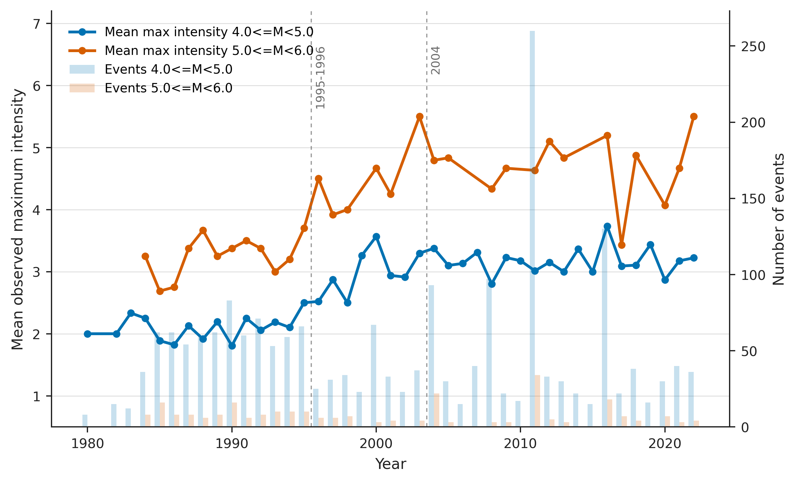

*Figure 1. Annual maximum intensity and event count diagnostics for the shallow approximately inland subset. The increasing maximum intensity for fixed magnitude classes is interpreted jointly with network-density changes rather than as a direct temporal change in earthquake source strength.*

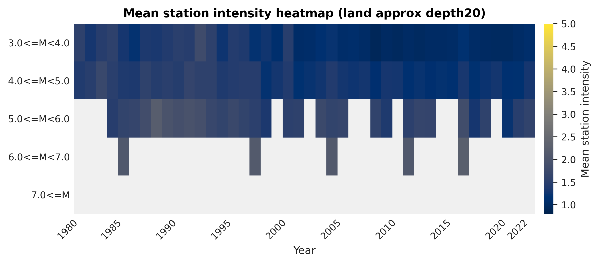

*Figure 2. Event mean station intensity by year and magnitude bin. The heat map emphasizes that event means and event maxima respond differently to network expansion.*

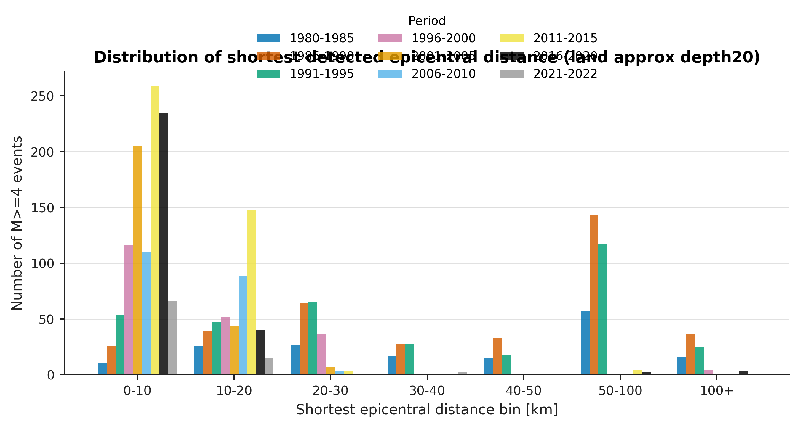

*Figure 3. The reporting network moved from sparse near-source sampling to much shorter nearest-station distances after the mid-1990s.*

### 4.2 Surface-site information provides a necessary but incomplete correction

The J-SHIS AVS30 and amplification maps show strong regional structure: low-velocity and high-amplification zones are concentrated in major sedimentary basins, plains, and reclaimed/coastal lowlands, whereas mountainous areas are generally higher velocity and lower amplification. Applying the amplification correction before interpolation materially improves physical consistency, because the interpolation target is a bedrock-referenced field rather than a mixture of path, source, and local site effects.

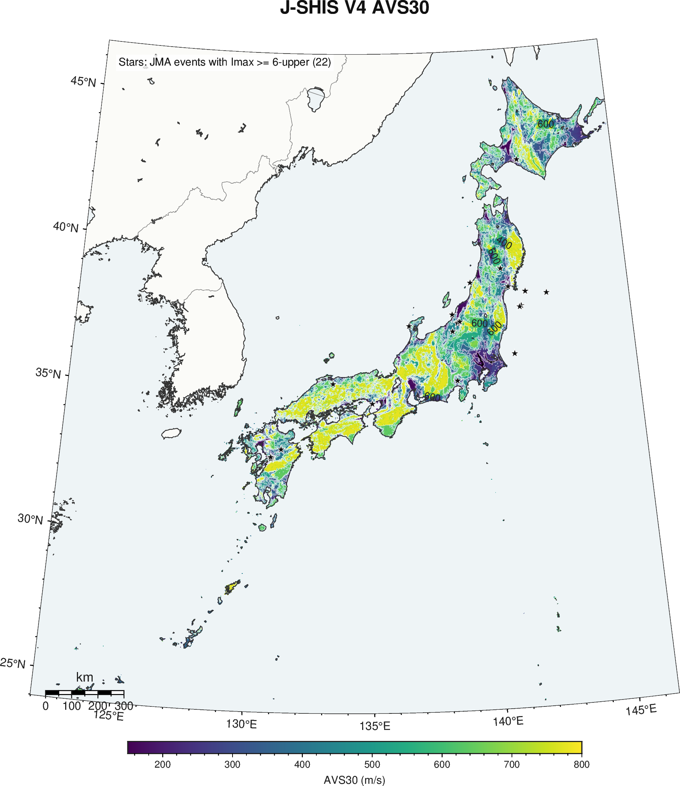


*Figure 4. Surface-site information used in this study. AVS30 and engineering-bedrock-to-surface amplification are used to remove and restore site effects during interpolation.*

### 4.3 Attenuation-only prediction is a weak zero-station baseline

Treating zero observations as `gmpe_raw`, the attenuation-only prediction has RMSE 0.728 and exact class hit rate 0.455. It overpredicts the class at 0.477 of withheld stations and underpredicts at 0.062. Calibration to retained stations without residual interpolation (`gmpe_calibrated`) improves exact class hit rate to 0.588, but it does not reach the 70% class-hit criterion because spatial residuals remain unresolved.

**Table 2. Overall cross-validation accuracy by method.**

| Method | RMSE | MAE | Exact class | Within one class | Over | Under | Class MAE |
| --- | --- | --- | --- | --- | --- | --- | --- |
| gmpe_raw | 0.728 | 0.610 | 0.455 | 0.942 | 0.477 | 0.062 | 0.601 |
| gmpe_calibrated | 0.513 | 0.406 | 0.588 | 0.976 | 0.176 | 0.238 | 0.442 |
| idw | 0.384 | 0.292 | 0.680 | 0.991 | 0.135 | 0.180 | 0.329 |
| kriging | 0.390 | 0.297 | 0.675 | 0.991 | 0.137 | 0.184 | 0.335 |
| gmpe_kriging | 0.391 | 0.297 | 0.674 | 0.991 | 0.138 | 0.185 | 0.336 |

### 4.4 Station-density requirement for class-preserving interpolation

Using exact class hit rate as the primary criterion, IDW, smoothing kriging, and GMPE-residual kriging reach 65% class accuracy at about 6.64 stations per 10,000 km2, corresponding to median retained-station nearest-neighbor distance of about 12.99 km. They reach approximately 68% at about 23.32 stations per 10,000 km2 and 70% at about 57.68 stations per 10,000 km2, corresponding to a median nearest-neighbor distance of about 4.35 km.

The 80% and 90% exact-class criteria are not reached by any method when evaluated by density-bin median accuracy. The maximum effective density tested in individual trials is 71.58 stations per 10,000 km2. Even for the 0.9 retained-fraction trials, median exact-class accuracy is only 0.694 for IDW, 0.695 for kriging, and 0.696 for GMPE-residual kriging. Kriging and GMPE-residual kriging exceed 0.80 in only isolated individual trials, representing 0.15% of trials, and no trial reaches 0.90. Therefore, the density required for 80% or 90% exact-class agreement is not empirically identifiable from the present cross-validation data. At minimum it exceeds the tested maximum density, and the observed high-density saturation suggests that model improvements, not only denser stations, are required. These thresholds are substantially stricter than RMSE-based criteria because a small continuous error can cross a JMA class boundary.

**Table 3. Density required to reach selected exact class-hit criteria.**

| Method | Criterion | Density (/10,000 km2) | Median NN (km) | Exact class | Status |
| --- | --- | --- | --- | --- | --- |
| gmpe_raw | exact>=0.65 |  |  |  | not_reached |
| gmpe_raw | exact>=0.68 |  |  |  | not_reached |
| gmpe_raw | exact>=0.70 |  |  |  | not_reached |
| gmpe_raw | exact>=0.80 |  |  |  | not_reached |
| gmpe_raw | exact>=0.90 |  |  |  | not_reached |
| gmpe_calibrated | exact>=0.65 |  |  |  | not_reached |
| gmpe_calibrated | exact>=0.68 |  |  |  | not_reached |
| gmpe_calibrated | exact>=0.70 |  |  |  | not_reached |
| gmpe_calibrated | exact>=0.80 |  |  |  | not_reached |
| gmpe_calibrated | exact>=0.90 |  |  |  | not_reached |
| idw | exact>=0.65 | 6.64 | 12.99 | 0.656 | reached |
| idw | exact>=0.68 | 23.32 | 6.89 | 0.690 | reached |
| idw | exact>=0.70 | 57.68 | 4.35 | 0.703 | reached |
| idw | exact>=0.80 |  |  |  | not_reached |
| idw | exact>=0.90 |  |  |  | not_reached |
| kriging | exact>=0.65 | 6.64 | 12.99 | 0.654 | reached |
| kriging | exact>=0.68 | 23.32 | 6.89 | 0.683 | reached |
| kriging | exact>=0.70 | 57.68 | 4.35 | 0.704 | reached |
| kriging | exact>=0.80 |  |  |  | not_reached |
| kriging | exact>=0.90 |  |  |  | not_reached |
| gmpe_kriging | exact>=0.65 | 6.64 | 12.99 | 0.654 | reached |
| gmpe_kriging | exact>=0.68 | 23.32 | 6.89 | 0.681 | reached |
| gmpe_kriging | exact>=0.70 | 57.68 | 4.35 | 0.703 | reached |
| gmpe_kriging | exact>=0.80 |  |  |  | not_reached |
| gmpe_kriging | exact>=0.90 |  |  |  | not_reached |


*Figure 5. Exact intensity-class hit rate versus effective station density. The zero-density point is the attenuation-only prediction. The main interpolation methods reach the 70% criterion but do not reach the 80% or 90% criteria within the tested density range.*

### 4.5 Improvement relative to attenuation-only prediction

At the high-density bin [50,75) stations per 10,000 km2, IDW, kriging, and GMPE-residual kriging achieve exact class hit rates of 0.703, 0.704, and 0.703, respectively. Relative to attenuation-only prediction, the class-hit gain is about 24.8 percentage points. RMSE decreases from 0.728 to 0.354 for kriging, a reduction of 51.3%.

**Table 4. Improvement over attenuation-only prediction at selected density bins.**

| Method | Density bin | Median density | Median NN km | RMSE | Exact class | Gain vs raw | RMSE reduction | Over | Under |
| --- | --- | --- | --- | --- | --- | --- | --- | --- | --- |
| gmpe_raw | [0.0, 5.0) | 0.00 |  | 0.728 | 0.455 | 0.0 pp | 0.0% | 0.477 | 0.062 |
| idw | [0.0, 5.0) | 2.46 | 37.62 | 0.561 | 0.608 | 15.3 pp | 23.0% | 0.176 | 0.203 |
| idw | [5.0, 10.0) | 6.64 | 12.99 | 0.411 | 0.656 | 20.1 pp | 43.6% | 0.150 | 0.190 |
| idw | [20.0, 30.0) | 23.32 | 6.89 | 0.373 | 0.690 | 23.5 pp | 48.8% | 0.132 | 0.175 |
| idw | [50.0, 75.0) | 57.68 | 4.35 | 0.350 | 0.703 | 24.8 pp | 52.0% | 0.122 | 0.174 |
| kriging | [0.0, 5.0) | 2.46 | 37.62 | 0.588 | 0.602 | 14.7 pp | 19.3% | 0.170 | 0.214 |
| kriging | [5.0, 10.0) | 6.64 | 12.99 | 0.416 | 0.654 | 19.9 pp | 42.8% | 0.150 | 0.193 |
| kriging | [20.0, 30.0) | 23.32 | 6.89 | 0.382 | 0.683 | 22.8 pp | 47.5% | 0.134 | 0.179 |
| kriging | [50.0, 75.0) | 57.68 | 4.35 | 0.354 | 0.704 | 24.8 pp | 51.3% | 0.122 | 0.170 |
| gmpe_kriging | [0.0, 5.0) | 2.46 | 37.62 | 0.591 | 0.608 | 15.3 pp | 18.8% | 0.173 | 0.219 |
| gmpe_kriging | [5.0, 10.0) | 6.64 | 12.99 | 0.417 | 0.654 | 19.9 pp | 42.8% | 0.149 | 0.190 |
| gmpe_kriging | [20.0, 30.0) | 23.32 | 6.89 | 0.384 | 0.681 | 22.5 pp | 47.3% | 0.133 | 0.181 |
| gmpe_kriging | [50.0, 75.0) | 57.68 | 4.35 | 0.354 | 0.703 | 24.8 pp | 51.4% | 0.122 | 0.171 |


*Figure 6. Improvement in exact class hit rate relative to the attenuation-only prediction. The largest gain occurs when moving from zero observations to a sparse but nonzero observation set, but reaching 70% requires much higher density.*

### 4.6 Regional dependence of prediction skill

Prediction accuracy remains regionally variable even at high station density. In the high-density bin, kriging exact class accuracy is 0.696 in Hokkaido, 0.691 in Tohoku, 0.738 in Kanto, 0.707 in Chubu-Hokuriku, 0.783 in Kinki-Chugoku-Shikoku, and 0.645 in Kyushu. These differences do not map simply onto station density; they also reflect event geometry, the distribution of withheld stations, offshore versus inland source locations, and surface-site variability.

**Table 5. Regional high-density accuracy for attenuation-only prediction and kriging.**

| Region | Method | Predictions | Exact class | RMSE | Gain vs raw | RMSE reduction |
| --- | --- | --- | --- | --- | --- | --- |
| Hokkaido | gmpe_raw | 27350 | 0.533 | 0.629 | 0.0 pp | 0.0% |
| Hokkaido | kriging | 657 | 0.696 | 0.372 | 16.3 pp | 40.8% |
| Tohoku | gmpe_raw | 101118 | 0.436 | 0.705 | 0.0 pp | 0.0% |
| Tohoku | kriging | 3751 | 0.691 | 0.382 | 25.5 pp | 45.8% |
| Kanto | gmpe_raw | 117003 | 0.446 | 0.633 | 0.0 pp | 0.0% |
| Kanto | kriging | 4773 | 0.738 | 0.302 | 29.2 pp | 52.3% |
| Chubu-Hokuriku | gmpe_raw | 137759 | 0.432 | 0.725 | 0.0 pp | 0.0% |
| Chubu-Hokuriku | kriging | 5860 | 0.707 | 0.363 | 27.6 pp | 50.0% |
| Kinki-Chugoku-Shikoku | gmpe_raw | 62352 | 0.464 | 0.704 | 0.0 pp | 0.0% |
| Kinki-Chugoku-Shikoku | kriging | 1542 | 0.783 | 0.281 | 31.9 pp | 60.1% |
| Kyushu | gmpe_raw | 44188 | 0.400 | 0.811 | 0.0 pp | 0.0% |
| Kyushu | kriging | 932 | 0.645 | 0.412 | 24.5 pp | 49.2% |

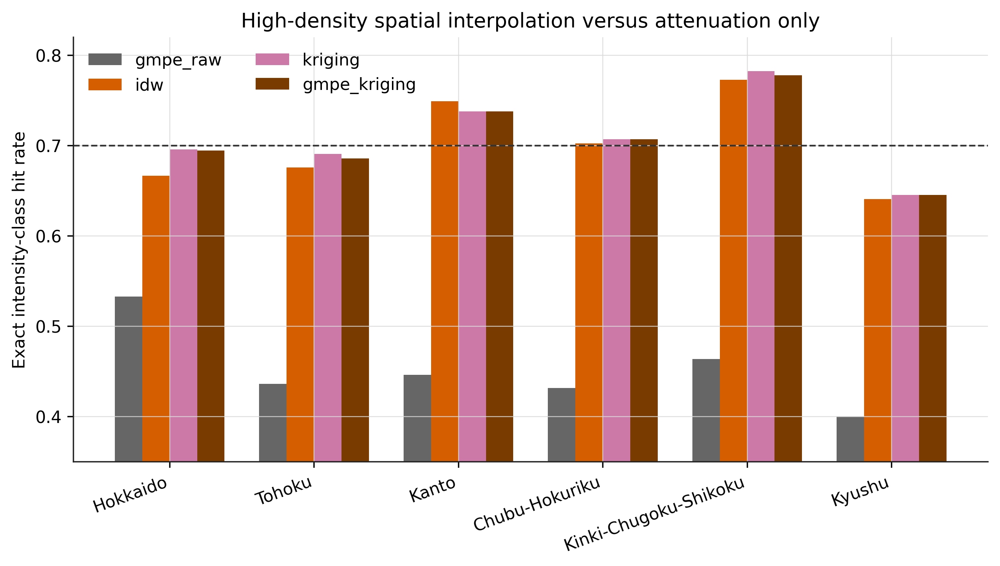

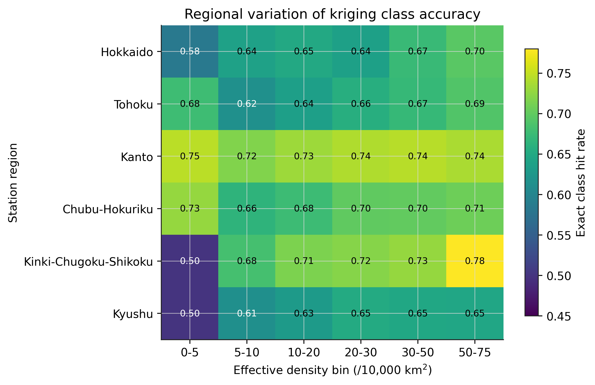

*Figures 7-8. Spatial interpolation improves all regions relative to attenuation-only prediction, but the class-preserving hit rate remains regionally heterogeneous.*

### 4.7 Ground-complexity diagnostics

Local site-amplification variability is not a monotonic predictor of error in the present station-based cross validation. This does not imply that surface geology is unimportant. Rather, station locations are not uniformly distributed across site-complexity classes, the site correction removes first-order amplification effects, and the validation target is a point observation rather than an independently known continuous intensity field. Event-scale Spearman correlations between ground-complexity metrics and median error are generally weak and unstable across methods.

**Table 6. Local ground-complexity bins and interpolation accuracy.**

| Method | Complexity bin | Median local site-delta std. | Exact class | RMSE | Class MAE |
| --- | --- | --- | --- | --- | --- |
| gmpe_kriging | very_low | 0.110 | 0.672 | 0.398 | 0.338 |
| gmpe_kriging | low | 0.148 | 0.675 | 0.395 | 0.337 |
| gmpe_kriging | middle | 0.179 | 0.657 | 0.418 | 0.356 |
| gmpe_kriging | high | 0.215 | 0.656 | 0.411 | 0.358 |
| gmpe_kriging | very_high | 0.286 | 0.702 | 0.362 | 0.306 |
| idw | very_low | 0.110 | 0.677 | 0.391 | 0.333 |
| idw | low | 0.148 | 0.678 | 0.388 | 0.334 |
| idw | middle | 0.179 | 0.665 | 0.407 | 0.346 |
| idw | high | 0.215 | 0.663 | 0.401 | 0.350 |
| idw | very_high | 0.286 | 0.704 | 0.356 | 0.303 |
| kriging | very_low | 0.110 | 0.673 | 0.397 | 0.337 |
| kriging | low | 0.148 | 0.676 | 0.395 | 0.336 |
| kriging | middle | 0.179 | 0.657 | 0.417 | 0.356 |
| kriging | high | 0.215 | 0.656 | 0.411 | 0.357 |
| kriging | very_high | 0.286 | 0.701 | 0.362 | 0.307 |

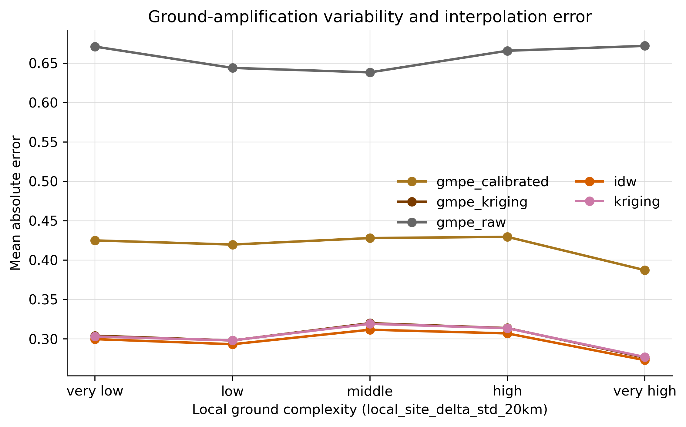

### 4.8 Representative mapped distributions

The 2016 Kumamoto earthquake sequence illustrates the qualitative difference between attenuation-only prediction, calibrated attenuation, and observation-constrained residual interpolation. The attenuation-only field is smooth and distance controlled. The residual kriging field retains the broad distance trend but introduces local intensity anomalies supported by observations and surface-site corrections. This is consistent with the conceptual design of ShakeMap-like systems: a prediction equation provides a broad prior, whereas observations constrain local deviations.

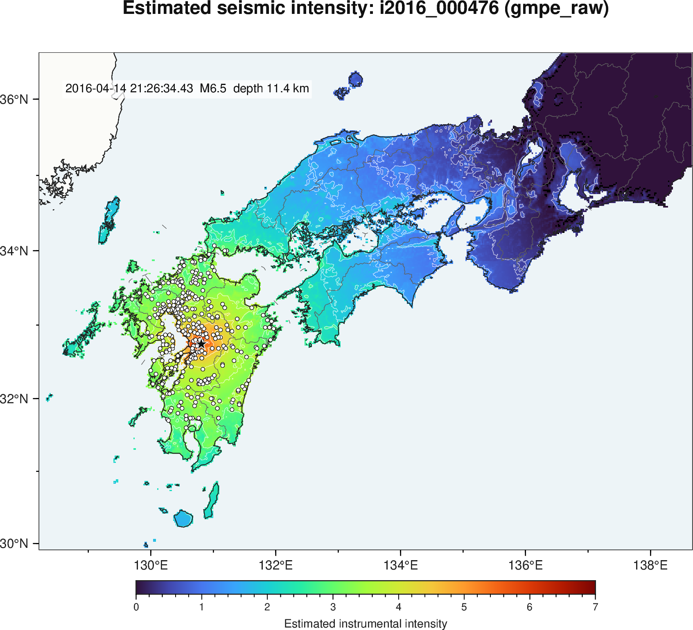

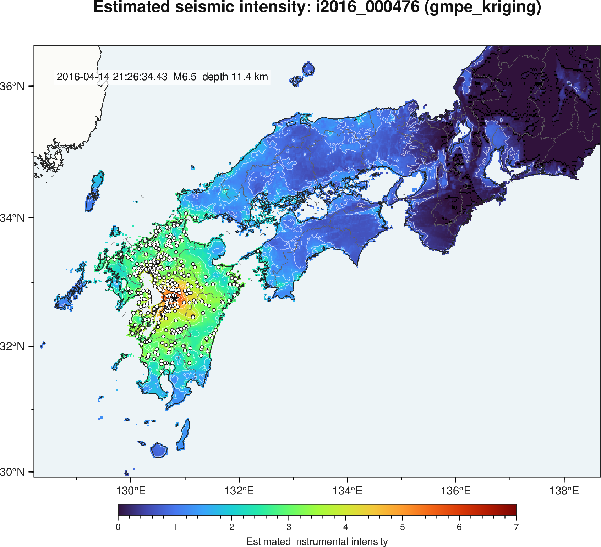

*Figure 10. Representative estimated intensity distributions for the 2016 Kumamoto earthquake. The maps are methodological reconstructions from the present workflow, not official JMA products.*

### 4.9 Counterfactual network density for the 2018 northern Osaka earthquake

To illustrate how a recent inland earthquake would have been mapped before the rapid network expansion, we analyzed the 18 June 2018 northern Osaka earthquake (`i2018_000842`; M6.1; depth 13.0 km; maximum measured intensity 5.6). The current-network scenario used 465 actual 2018 observations within 100 km of the epicenter. The pre-expansion counterfactual used the 59 station locations that were active at the end of 1995 within the same radius, assigning each location the nearest 2018 observed intensity within 10 km. This resampling isolates the effect of network density and geometry; it does not reproduce the site response, instrumentation, or operational processing of the historical stations. A stricter sensitivity case used only the 21 station codes that were active in 1995 and also appeared in the 2018 observations.

**Table 7. Key results for the 2018 northern Osaka network-density counterfactual.**

| Scenario | Stations within 100 km | Density (stations/10,000 km2) | Stations within 10 km | Stations within 20 km | Median station NN km | Exact class accuracy, all | Exact class accuracy, I>=5.0 | I>=5.5 footprint km2 |
| --- | --- | --- | --- | --- | --- | --- | --- | --- |
| 2018 observed network | 465 | 148.014 | 11 | 54 | 3.560 | 0.877 | 0.643 | 60.626 |
| 1995 active-site geometry | 59 | 18.780 | 2 | 5 | 9.320 | 0.572 | 0.357 | 4.041 |
| Strict 1995 code overlap | 21 | 6.685 | 1 | 1 | 19.939 | 0.551 | 0.143 | 8.083 |

The current network directly constrains the near-source gradients and the spatial transition from the Osaka Plain to the Kyoto and Nara basins. In contrast, the 1995 active-site geometry leaves only five stations within 20 km of the epicenter, making the map more dependent on the GMPE prior and a small set of residual constraints. With GMPE-residual kriging, the current network gives a maximum estimated intensity of 5.82, an I>=5.0 area of 464.8 km2, and an I>=5.5 area of 60.6 km2. Under the 1995 geometry, these decrease to 5.50, 283.0 km2, and 4.0 km2, respectively. Exact class accuracy at the 2018 observation sites decreases from 0.877 to 0.572 for all stations and from 0.643 to 0.357 for stations with I>=5.0. The current-network evaluation is an upper-bound reconstruction because the validation set includes training observations; even with this asymmetry, the counterfactual demonstrates that the pre-expansion geometry cannot stably constrain the localized high-intensity footprint. Because seismic intensity is not a linear amplitude, the primary comparison metric is the intensity difference ΔI rather than the ratio of intensity values. As a supplementary physical scale, Figure 11 also shows the equivalent PGV ratio implied by `I = 2.68 + 1.72 log10(PGV)`.

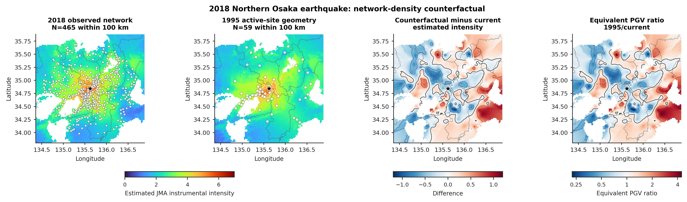

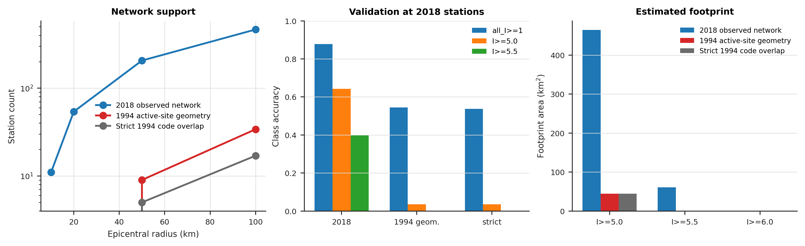

*Figures 11-12. Counterfactual analysis for the 2018 northern Osaka earthquake. Figure 11 places the two estimated intensity fields, the intensity difference ΔI, and the supplementary equivalent PGV ratio side by side. The 1995-like network is a resampling experiment for station geometry and should not be interpreted as a reproduction of an official historical JMA map.*

## 5. Discussion

### 5.1 Catalog trends are inseparable from observation-system history

The central catalog result is a statistical paradox: after network expansion, maximum intensity increases while mean station intensity decreases. The maximum is sensitive to whether a station lies close to the strongest shaking, whereas the mean is sensitive to how many low-intensity observations are included at larger distances. This explains why maximum intensity can reproduce the qualitative behavior emphasized by Sugiyama et al. (2020), while event mean intensity can move in the opposite direction. Therefore, event mean intensity should not be interpreted as a direct proxy for earthquake strength or ground-motion severity without controlling for station support, distance distribution, and detection thresholds.

### 5.2 Class-preserving accuracy is a stricter target than continuous RMSE

An RMSE criterion near 0.5 intensity units may appear adequate for many engineering summaries, but it is not sufficient when the objective is to preserve the JMA intensity class. A prediction error of 0.2 can be inconsequential far from a class boundary or decisive near one. This is why the density required for a 70% exact class hit rate is much larger than the density suggested by continuous-error criteria. The 80% and 90% exact-class criteria are not reached in the present tested density range. Operationally, this argues for reporting both continuous uncertainty and class-boundary uncertainty in estimated intensity products.

### 5.3 Why GMPE-residual kriging did not clearly outperform ordinary kriging

The GMPE-residual method is theoretically attractive because it separates a broad source-distance trend from local residuals, consistent with Worden et al. (2010). In the present results, however, GMPE-residual kriging is nearly tied with smoothing ordinary kriging and IDW. The likely reason is not that GMPE reference fields are useless, but that the current implementation uses simplified point-source geometry, a proxy fault distance, and generic fault-type assumptions. For large offshore or finite-fault events, a better rupture model, moment magnitude, fault-plane distance, and event-specific path corrections should increase the value of the GMPE prior, especially outside the convex hull of dense observations.

### 5.4 Implications for estimated intensity maps

JMA cautions that estimated intensity map cells should not be interpreted as exact uniform shaking within a mesh and that estimates may differ by about one intensity class in some cases (JMA, n.d.-c). The present cross-validation provides empirical support for that caution. One-class-within rates are high even at modest density, but exact class matching requires dense station support. For response use, this suggests that intensity maps should be interpreted as spatially smoothed class-likelihood fields rather than as deterministic class labels.

### 5.5 Regional dependence and network-design implications

Regional skill differences imply that a single national density threshold is only a first-order design number. Mountainous terrain, sedimentary basins, coastal plains, offshore ruptures, and island geometry can all change interpolation difficulty. The high-density regional results suggest that future network design should prioritize not only average density but also coverage of known amplification gradients and source regions that commonly place strong shaking outside the densest station clusters.

### 5.6 Extrapolating recent earthquakes to historical networks

The northern Osaka counterfactual shows that network expansion affects not only catalog statistics but also the practical quality of mapped intensity distributions. A few near-source observations are not sufficient to recover the shape of a localized strong-motion footprint, especially around basin margins and steep amplification gradients. When comparing recent earthquakes with historical events, the high-resolution maps available under the modern network should not be assumed to have equivalent quality under the historical network. A defensible comparison should include a historical-network resampling, attenuation-only prediction, and explicit uncertainty bounds.

## 6. Limitations

This study has several limitations that should be addressed before journal submission. First, the inland/shallow subset is based on an operational approximation and should be replaced or complemented by a reproducible land-polygon and tectonic classification. Second, the GMPE baseline uses simplified source geometry; finite-fault distance and event-specific fault type should be introduced for large events. Third, the J-SHIS site correction uses gridded amplification factors and does not necessarily represent the exact site condition at every intensity meter. Fourth, cross-validation at observation sites measures station-prediction skill, not the accuracy of an independently known continuous intensity field. Fifth, the regional classification is a broad lat/lon grouping; a final submission should use a seismotectonic or administrative regionalization with uncertainty estimates.

## 7. Conclusions

1. The JMA seismic-intensity catalog cannot be interpreted without the history of the observation network. For shallow approximately inland M4-5 events, maximum intensity increased by about 1.12 intensity units from 1980-1995 to 2011-2022, while event mean station intensity decreased by about 0.29 units.
2. The decrease in event mean intensity is not evidence that shaking became weaker; it is a consequence of adding many more reporting stations, including distant low-intensity stations.
3. Treating zero observations as attenuation-only prediction gives an exact JMA class hit rate of 0.455 and RMSE of 0.728 for the 22 intensity-6-upper-or-larger events.
4. Observation-constrained interpolation reaches a 70% exact class hit rate only at about 57.7 retained stations per 10,000 km2, with median nearest-neighbor spacing of about 4.35 km.
5. The 80% and 90% exact-class criteria are not stably reached within the maximum tested effective density of 71.58 stations per 10,000 km2. Under the current workflow, high-density accuracy saturates near 70%, implying that source, path, site, and uncertainty modeling must improve before 80% exact-class agreement can be expected.
6. At the 70% threshold density, IDW, smoothing kriging, and GMPE-residual kriging improve exact class accuracy by about 25 percentage points and reduce RMSE by about one half relative to attenuation-only prediction.
7. Regional differences remain even at high density, indicating that station density, source geometry, and surface-site variability must be treated jointly in both scientific interpretation and operational mapping.
8. For the 2018 northern Osaka earthquake, resampling the network to the 1995 active-site geometry reduces the 100-km station count from 465 to 59 and lowers GMPE-residual-kriging exact class accuracy from 0.877 to 0.572 at the 2018 observation sites. The estimated I>=5.5 area shrinks from 60.6 km2 to 4.0 km2, demonstrating that modern mapped intensity fields cannot be extrapolated to pre-expansion networks at equivalent quality.

## Acknowledgments

[Funding, institutional support, and collaborator acknowledgments to be inserted. JMA and NIED/J-SHIS are acknowledged as data providers.]

## References

- Japan Meteorological Agency (JMA) (n.d.-a). Tables explaining the JMA Seismic Intensity Scale. https://www.jma.go.jp/jma/en/Activities/inttable.html (accessed 9 May 2026)
- Japan Meteorological Agency (JMA) (n.d.-b). 推計震度分布図の求め方について [Method for estimated seismic intensity distribution maps]. https://www.jma.go.jp/jma/kishou/know/jishin/suikei/motomekata.html (accessed 9 May 2026)
- Japan Meteorological Agency (JMA) (n.d.-c). 推計震度分布図について [Estimated seismic intensity distribution maps]. https://www.jma.go.jp/jma/kishou/know/jishin/suikei/kaisetsu.html (accessed 9 May 2026)
- Japan Meteorological Agency (JMA) (n.d.-d). 震源データ [Hypocenter data]. https://www.data.jma.go.jp/eqev/data/bulletin/hypo.html (accessed 9 May 2026)
- National Research Institute for Earth Science and Disaster Resilience (NIED) (n.d.-a). J-SHIS: Japan Seismic Hazard Information Station. https://www.j-shis.bosai.go.jp/en/ (accessed 9 May 2026)
- National Research Institute for Earth Science and Disaster Resilience (NIED) (n.d.-b). User guide to J-SHIS: Site Amplification Factor. https://www.j-shis.bosai.go.jp/map/JSHIS2/man/en/man_subsurface_ground.html (accessed 9 May 2026)
- Si, H., and Midorikawa, S. (1999). New attenuation relationships for peak ground acceleration and velocity considering effects of fault type and site condition. Journal of Structural and Construction Engineering (Transactions of AIJ), 64(523), 63-70. https://doi.org/10.3130/aijs.64.63_2
- Sugiyama, Mitsuki, Yoshioka, Yuki, Hirai, Takashi, and Fukuwa, Nobuo (2020). Transition in Seismic Intensity Information Obtained by the Seismic Intensity Observation System. Journal of Japan Association for Earthquake Engineering, 20(7), 7_101-7_119. https://doi.org/10.5610/jaee.20.7_101
- Wald, D. J., Quitoriano, V., Heaton, T. H., Kanamori, H., Scrivner, C. W., and Worden, C. B. (1999). TriNet ShakeMaps: Rapid generation of peak ground motion and intensity maps for earthquakes in southern California. Earthquake Spectra, 15(3), 537-555. https://doi.org/10.1193/1.1586057
- Worden, C. B., Wald, D. J., Allen, T. I., Lin, K., Garcia, D., and Cua, G. (2010). A revised ground-motion and intensity interpolation scheme for ShakeMap. Bulletin of the Seismological Society of America, 100(6), 3083-3096. https://doi.org/10.1785/0120100101
- Yamamoto, S., Aoi, S., Kunugi, T., and Suzuki, W. (2011). Improvement in the accuracy of expected seismic intensities for earthquake early warning in Japan using empirically estimated site amplification factors. Earth, Planets and Space, 63, 57-69. https://doi.org/10.5047/eps.2010.12.002
