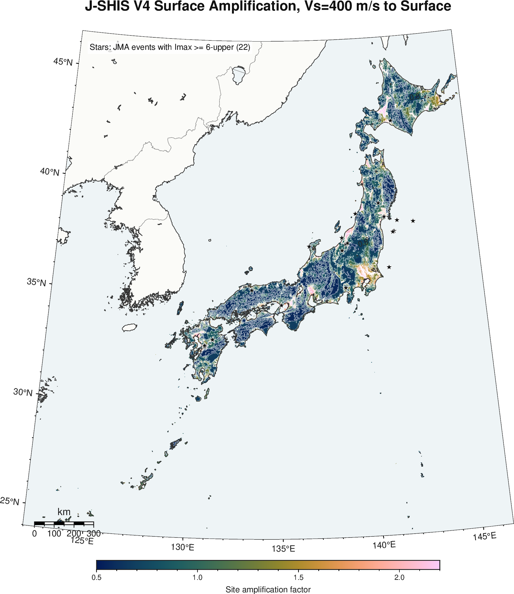
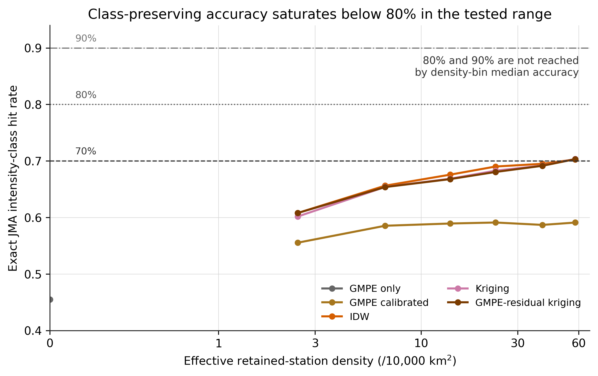
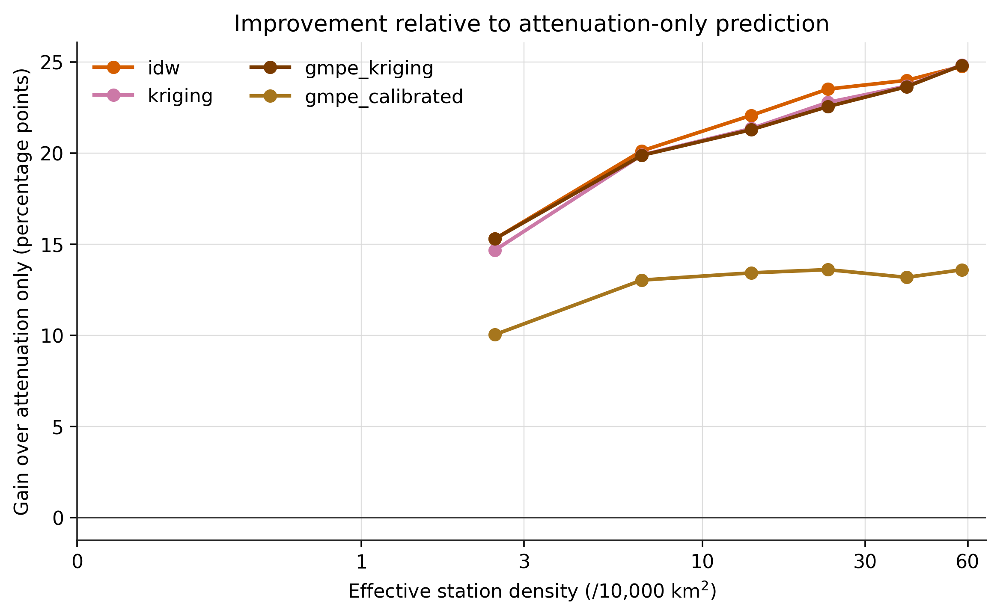

# 気象庁震度観測網の年代差が震度統計と推計震度分布に及ぼす影響：震度階級を保存する空間補間に必要な観測点密度

**著者:** Mitsuki Sugiyama [所属，ORCID，責任著者連絡先を挿入]

## 要旨

気象庁震度データは，世界的にも高密度な計測震度アーカイブである。一方で，1995年兵庫県南部地震以降に震度観測網が急速に拡充されたため，カタログから得られる最大震度や平均震度の時系列を，地震活動または揺れの強さそのものの変化として直接解釈することはできない。本研究では，1980-2022年の気象庁震度カタログを解析し，気象庁一元化震源データおよびJ-SHIS表層地盤情報と統合した。まず，震度観測網の発展がイベント単位の震度統計に与える影響を定量化した。浅部・概ね内陸のM4-5地震では，1地震あたりの有効震度観測点数は1980-1995年の平均4.56点から2011-2022年の平均139.69点へ増加し，震央から最寄り報告観測点までの中央値は49.57 kmから7.10 kmへ短縮した。同期間に平均最大震度は2.08から3.20へ増加したが，イベント内の観測点平均震度は1.48から1.19へ低下した。これは，多数の遠方・低震度観測点が平均に加わったためである。次に，震度6強以上を観測した22地震を対象として，震度分布補間の精度を検証した。観測震度をJ-SHIS地盤増幅率により工学的基盤相当の震度場へ変換し，IDW，平滑化通常クリギング，距離減衰式残差クリギングで補間した後，評価地点の地盤増幅を考慮して地表震度へ戻した。観測点をランダムに間引く交差検証では，予測震度が観測震度階級と完全一致する割合を主指標とした。観測点0の状態を距離減衰式のみによる予測と定義すると，Si and Midorikawa型の距離減衰参照場の震度階級完全一致率は0.455であった。一方，観測値に拘束された補間が完全一致率70%に達するためには，約57.7点/10,000 km2の有効保持観測点密度，すなわち保持観測点間の最近接距離中央値約4.35 kmが必要であった。この密度での距離減衰式単独に対する改善量は，震度階級完全一致率で約25ポイント，RMSEで約51-52%である。しかし，完全一致率80%および90%の基準は，試験した最大密度範囲内では密度ビン中央値として到達しなかった。したがって，80%以上の階級一致を要求する場合，単なる観測点密度の増加だけでなく，震源モデル，距離減衰参照場，地盤補正，不確実性重み付けの改善が必要である。高密度条件でも地域差は残り，震度分布の解釈には観測点密度，震源幾何，地盤増幅の空間変動を同時に考慮する必要がある。

**キーワード:** 気象庁震度，震度観測網，推計震度分布，空間補間，地盤増幅，観測点密度，J-SHIS，クリギング，距離減衰式

## 主要な結論

- 1995年以降の震度観測網拡充により，固定したマグニチュード階級でも最大震度は上昇しやすくなった。これは震源近傍に観測点が存在する確率が上がったためであり，地震動そのものの単純な長期増加を意味しない。
- イベント平均震度は最大震度と逆方向に変化し得る。観測網が高密度化すると，遠方の低震度観測点が平均に含まれるため，平均震度は低下し得る。
- 震度階級の完全一致を目標とする補間では，RMSEだけを基準とする場合より高密度の観測点が必要である。本検証では，完全一致率70%に達するために約57.7点/10,000 km2，最近接距離中央値約4.35 kmが必要であった。
- 完全一致率80%・90%は，現在の間引き交差検証で試験した密度範囲では到達しなかった。高密度ビン[50,75)点/10,000 km2でも，主要補間法の完全一致率は約70%で頭打ちとなる。
- 距離減衰式単独は観測点0状態の合理的な基準であるが，局所的な震度階級を再現するには不十分である。高密度観測値に基づく補間は，距離減衰式単独に対して完全一致率を約25ポイント改善した。

## 平易な要約

日本では地震の揺れを震度として発表している。1995年兵庫県南部地震以降，震度観測点数が大きく増えたため，近年の地震では震央近くの強い揺れを観測しやすくなった。その結果，同じ規模の地震でも最大震度は昔より大きく出やすい。一方，平均震度は逆に小さくなることがある。これは，昔は少数の観測点だけが平均に入っていたのに対し，現在は遠方の弱い揺れも多数含まれるからである。また，震度分布図を観測点から補間するには，かなり高い観測点密度が必要である。距離減衰式だけでは震度階級の完全一致率は約46%であり，70%程度に上げるには，10,000 km2あたり約58点，観測点間隔で約4 km程度の密度が必要であった。80%や90%の完全一致は，本研究で試した密度範囲では達成できず，観測点を増やすだけでなく予測モデル自体の改善が必要である。

## 1. はじめに

震度は，日本の地震防災，緊急対応，行政判断，報道，住民行動に直接結びつく指標である。PGAやPGVのような物理量と異なり，震度は人間が理解しやすい揺れの強さとして発表され，災害対応の実務で用いられる。気象庁（n.d.-a）は，震度が観測点における揺れであり，同一市町村内でも地盤条件や地形により異なり得ることを明示している。また，推計震度分布図では，観測点のない地域の震度を，観測震度および地盤増幅度等を用いて推定している。2023年2月以降は，推計震度分布図のメッシュが従来の1 kmから250 mへ高解像度化され，浅い地震では緊急地震速報で用いられる震源・距離に基づく予測場も参照されるようになった（気象庁, n.d.-b; 気象庁, n.d.-c）。

このような震度情報の利点は，同時に科学的解析上の難しさを生む。特に重要なのは，震度観測網が時間的に一定ではない点である。1995年兵庫県南部地震を契機として，気象庁，自治体，防災科学技術研究所K-NET等の観測点が震度発表に取り込まれ，震度観測点数は不連続的に増加した。杉山・他（2020）は，観測点密度が高くなるほど，より震源に近い観測点で強震動を記録する確率が増し，同程度のマグニチュードでも観測最大震度が大きくなりやすいことを示した。この指摘は，震度カタログ解析の基本的な前提を変える。すなわち，最大震度は地震規模・震源過程・地盤条件だけでなく，観測システムの空間配置にも依存する。

一方，面的な揺れ分布の推定に関しては，米国のShakeMapに代表されるように，距離減衰式，観測値，地盤補正を統合する枠組みが確立されてきた。Wald et al.（1999）は，迅速な地震動・震度マップ生成の実用的枠組みを示し，Worden et al.（2010）は，地震動予測式，観測値，変換値を不確実性を考慮しながら統合する補間手法を発展させた。日本の震度分布推定においても，距離減衰による大局的な減衰構造，観測震度による局所拘束，地盤増幅による表層補正をどう統合するかが中心課題である。しかし，気象庁震度階級を保存するという観点から，どの程度の観測点密度が必要かを，観測網の年代差と結びつけて定量化した研究は限られる。

本研究の目的は二つである。第一に，気象庁震度観測網の変遷が，年別・マグニチュード別の平均震度および最大震度の解釈にどのような影響を与えるかを明らかにする。第二に，震度6強以上を観測した地震を対象として，推計震度分布の空間補間に必要な観測点密度を，距離減衰式単独予測との比較により評価する。ここでは，連続値としてのRMSEだけでなく，予測震度が観測震度階級と一致するかを主指標とする。実務上，震度5弱と震度5強，震度6弱と震度6強の違いは，連続値誤差0.2-0.5程度以上の意味を持つ場合があるためである。

本研究では以下の仮説を検証する。

1. 観測網の高密度化は，震央最近接観測点距離を短縮し，固定マグニチュード階級における最大震度を増加させる。
2. イベント平均震度は，観測点数の増加により遠方・低震度観測点を含むため，最大震度とは逆に低下し得る。
3. 震度階級の完全一致を目標とする補間には，連続値RMSEで許容されるよりも高い観測点密度が必要である。
4. 補間精度は全国一律ではなく，観測点密度，震源幾何，地盤増幅の空間変動の相互作用により地域差を持つ。

## 2. データ

### 2.1 気象庁震度カタログと観測点履歴

1980-2022年の気象庁震度データを年別ファイルから読み込み，地震イベント単位に集約した。集約後のイベント数は87,151である。各イベントについて，発震時刻，カタログマグニチュード，深さ，震央地名，最大震度，有効観測点数，観測点平均震度，震央から最寄り報告観測点までの距離，最大震度観測点までの距離を整理した。また，ローカルアーカイブに含まれる観測点履歴ファイル`code_p.dat`を解析し，年別の稼働観測点数，観測点間最近接距離，地域別観測点分布を復元した。

### 2.2 震源カタログ

震度データに含まれる震源位置情報は，年代やファイル形式により精度が粗い場合がある。このため，気象庁一元化震源データを別途読み込み，震度イベントと照合した。解析では，照合後の`analysis_latitude`，`analysis_longitude`，`analysis_depth_km`，`analysis_magnitude`を優先的に用いた。気象庁震源データは，1919年以降の年別震源ファイルとして公開されている（気象庁, n.d.-d）。

### 2.3 J-SHIS表層地盤情報

表層地盤情報には，防災科学技術研究所J-SHISのAVS30および工学的基盤（Vs = 400 m/s）から地表への地盤増幅率を用いた。J-SHISは，全国地震動予測地図等で用いられる地盤情報を提供しており，AVS30および地盤増幅率を公開している（防災科学技術研究所, n.d.-a; 防災科学技術研究所, n.d.-b）。本研究では経度，緯度，AVS30，地盤増幅率を含む0.02度集約格子104,046セルを整備した。AVS30および地盤増幅率は，観測震度を基盤相当の場へ補正し，補間後に評価地点の地盤増幅を戻すために用いた。

### 2.4 補間対象地震

空間補間解析では，解析済み震度カタログにおいて震度6強または震度7を観測した22地震を対象とした。対象地震のマグニチュードは5.8-9.0であり，1995年兵庫県南部地震，2004年新潟県中越地震系列，2011年東北地方太平洋沖地震および主要余震，2016年熊本地震系列，2018年北海道胆振東部地震，2021-2022年の福島県沖の地震などを含む。

## 3. 方法

### 3.1 イベント単位震度統計

各地震について，観測最大震度，観測点平均震度，および計測震度が利用可能な場合は計測震度を優先し，ない場合は震度階級を用いる補助的平均震度を算出した。さらに，有効観測点数，震央から最寄り報告観測点までの距離，最大震度観測点までの距離を計算した。杉山・他（2020）との比較可能性を意識し，浅部・概ね内陸の地震を重視した。ここでの内陸判定は震央地名等に基づく運用上の近似であり，厳密な陸域ポリゴンまたはテクトニック分類ではない。

### 3.2 地盤増幅補正と基盤面補間

推計震度分布における地盤増幅の考え方を近似するため，観測点iの地表震度を次式により工学的基盤相当の震度へ変換した。

```math
I^{B}_{i}=I^{S}_{i}-1.72\log_{10}(A_i),
```

ここで，\(I^{S}_{i}\)は観測地表震度，\(A_i\)はJ-SHISのPGV地盤増幅率である。基盤相当震度\(I^B\)を空間補間した後，評価地点xの地表震度を次式で復元した。

```math
\hat{I}^{S}(x)=\hat{I}^{B}(x)+1.72\log_{10}(A(x)).
```

係数1.72は，本研究の実装で用いた震度換算式\(I=2.68+1.72\log_{10}(PGV)\)に対応する（Yamamoto et al., 2011）。したがって，PGVに対する乗法的な地盤増幅は，震度に対する加法的補正として扱われる。本処理は，気象庁の実運用アルゴリズムそのものの再現ではなく，公開情報と利用可能データに基づく研究用近似である。

### 3.3 空間補間法

主解析では，逆距離加重法（IDW），平滑化通常クリギング，および距離減衰式残差クリギングを用いた。線形補間，三次補間，スプライン補間，最近傍補間も図化用に実装したが，観測点間引きの交差検証では，対象22地震全体で安定して評価可能であったIDW，平滑化クリギング，距離減衰式残差クリギングを主対象とした。

平滑化通常クリギングでは，指数型共分散モデルを局所的に用い，観測点スケールのノイズや丸められた震度階級を完全再現しないように対角ナゲットを加えた。これは重要である。完全補間型のクリギングは高密度条件で局所ノイズを拾いやすく，平滑化を導入した場合にIDWと同程度の安定した性能を示した。

### 3.4 距離減衰式単独予測と残差補間

観測点を一切保持しない状態を，距離減衰式単独による予測と定義した。距離減衰参照場には，司・翠川（1999）のPGV式に基づく次式を用いた。

```math
\log_{10} PGV_{600}=0.58M+0.0038D+c_T-1.29-\log_{10}(R+0.0028\,10^{0.5M})-0.002R,
```

ここで，\(M\)はマグニチュード，\(D\)は深さ，\(c_T\)は断層タイプ項，\(R\)は断層距離の近似値である。全対象地震について有限断層モデルを用意していないため，本研究では震央距離と経験的な破壊長スケールから\(R\)を近似した。距離減衰式によるPGVは次式で震度へ変換した。

```math
I_{GMPE}=2.68+1.72\log_{10}PGV_{600}.
```

GMPE関連の手法として，観測値を一切使わない`gmpe_raw`，保持観測点により距離減衰場を線形較正するが残差補間はしない`gmpe_calibrated`，較正後の残差をクリギングする`gmpe_kriging`を評価した。この設計は，地震動予測式による事前場を観測値で拘束するShakeMap型の考え方に対応する。ただし，本研究ではWorden et al.（2010）のような完全な不確実性重み付けまでは導入していない。

### 3.5 交差検証と精度指標

22地震それぞれについて，観測点を保持点と検証点にランダム分割した。保持率は0.1，0.2，0.3，0.5，0.7，0.9とし，各保持率で5回の乱数試行を行った。予測は検証点位置でのみ評価した。主指標は，予測震度を気象庁震度階級へ変換したとき，観測震度階級と完全一致する割合である。連続値震度は，0.5，1.5，2.5，3.5，4.5，5.0，5.5，6.0，6.5を閾値として，震度0，1，2，3，4，5弱，5強，6弱，6強，7へ分類した。補助指標として，RMSE，MAE，1階級以内一致率，過大評価率，過小評価率，震度階級MAEも算出した。

有効保持観測点密度は次式で定義した。

```math
\rho = 10^4 N_{retained}/A,
```

ここで，\(A\)は対象地震ごとの評価領域面積（km2），\(N_{retained}\)は保持観測点数である。`gmpe_raw`は観測点0状態であるため，交差検証上の検証点は同じ観測データから抽出するが，定義上\(N_{retained}=0\)，\(\rho=0\)とした。

## 4. 結果

### 4.1 観測網の変遷により最大震度と平均震度の意味が分岐する

浅部・概ね内陸のM4-5地震では，有効観測点数の平均は1980-1995年の4.56点から2011-2022年の139.69点へ増加した。震央から最寄り報告観測点までの距離中央値は49.57 kmから7.10 kmへ短縮し，10 km以内に報告観測点を持つ地震の割合は10.0%から71.4%へ増加した。同期間に，観測最大震度の平均は2.08から3.20へ上昇したが，イベント平均震度は1.48から1.19へ低下した。

この結果は，最大震度と平均震度が異なる観測過程に支配されることを示す。最大震度は，強震域に観測点が存在するかに強く依存する。したがって，観測網が高密度化すれば，固定マグニチュード階級でも最大震度は上がりやすい。一方，平均震度は，分母となる観測点集合の広がりに影響される。現在の高密度観測網では，遠方の低震度観測点が多数加わるため，平均震度は低下し得る。

**表1. 浅部・概ね内陸地震における期間別震度統計の変化。**

| 期間 | マグニチュード階級 | 地震数 | 平均震度 | 平均最大震度 | 平均観測点数 | 最寄観測点距離中央値 (km) | 10 km以内割合 |
| --- | --- | --- | --- | --- | --- | --- | --- |
| 1980-1995 | 4.0<=M<5.0 | 762 | 1.48 | 2.08 | 4.56 | 49.57 | 10.0% |
| 1980-1995 | 5.0<=M<6.0 | 118 | 1.77 | 3.22 | 15.69 | 24.68 | 11.9% |
| 1996-2003 | 4.0<=M<5.0 | 273 | 1.32 | 3.07 | 55.78 | 8.00 | 63.0% |
| 1996-2003 | 5.0<=M<6.0 | 32 | 1.54 | 4.36 | 200.50 | 8.95 | 53.1% |
| 2004-2010 | 4.0<=M<5.0 | 314 | 1.27 | 3.13 | 87.38 | 7.68 | 65.3% |
| 2004-2010 | 5.0<=M<6.0 | 35 | 1.59 | 4.73 | 383.29 | 6.27 | 85.7% |
| 2011-2022 | 4.0<=M<5.0 | 672 | 1.19 | 3.20 | 139.69 | 7.10 | 71.4% |
| 2011-2022 | 5.0<=M<6.0 | 90 | 1.56 | 4.73 | 486.16 | 6.07 | 74.4% |


*図1. 浅部・概ね内陸地震における年別最大震度とイベント数。同一マグニチュード階級で最大震度が高くなる傾向は，震源強度の時間変化ではなく観測点密度の変化と併せて解釈すべきである。*


*図2. 年別・マグニチュード階級別の観測点平均震度。観測網拡充に対して，平均震度と最大震度は異なる応答を示す。*


*図3. 1990年代半ば以降，震央最近接観測点距離は大きく短縮した。これは最大震度統計の年代差を生む主要因である。*

### 4.2 表層地盤情報は必要だが，それだけでは十分でない

J-SHISのAVS30および地盤増幅率は，明瞭な地域構造を示す。低速度・高増幅の領域は，主要堆積盆地，平野部，沿岸低地，埋立地に集中し，山地では高速度・低増幅の傾向を示す。補間前に地盤増幅をキャンセルし，基盤相当場を補間してから評価地点の地盤増幅を戻す処理は，補間対象を震源・伝播・サイト効果が混在した地表場から，より物理的に整合的な基盤相当場へ近づける。

ただし，地盤増幅補正は完全ではない。J-SHIS格子値は観測点直下の局所条件を完全に表すわけではなく，震度計設置条件，微地形，非線形地盤応答，建物・設置環境の影響は残る。そのため，地盤補正後でも観測残差の空間補間が必要である。




*図4. 本研究で用いたJ-SHIS表層地盤情報。AVS30および工学的基盤から地表への増幅率を用いて，補間前後の地盤補正を行った。*

### 4.3 距離減衰式単独は観測点0状態の基準として有用だが，局所震度階級の再現性は低い

観測点0状態を`gmpe_raw`とすると，距離減衰式単独のRMSEは0.728，震度階級完全一致率は0.455であった。過大評価率は0.477，過小評価率は0.062であり，本実装では全体として過大評価傾向が強い。保持観測点により距離減衰場を線形較正する`gmpe_calibrated`では，完全一致率は0.588へ改善した。しかし，空間残差を補間しないため，70%の完全一致基準には到達しなかった。

**表2. 手法別の交差検証精度。**

| 手法 | RMSE | MAE | 階級完全一致 | 1階級以内 | 過大評価 | 過小評価 | 階級MAE |
| --- | --- | --- | --- | --- | --- | --- | --- |
| gmpe_raw | 0.728 | 0.610 | 0.455 | 0.942 | 0.477 | 0.062 | 0.601 |
| gmpe_calibrated | 0.513 | 0.406 | 0.588 | 0.976 | 0.176 | 0.238 | 0.442 |
| idw | 0.384 | 0.292 | 0.680 | 0.991 | 0.135 | 0.180 | 0.329 |
| kriging | 0.390 | 0.297 | 0.675 | 0.991 | 0.137 | 0.184 | 0.335 |
| gmpe_kriging | 0.391 | 0.297 | 0.674 | 0.991 | 0.138 | 0.185 | 0.336 |

### 4.4 震度階級を保存する補間に必要な観測点密度

震度階級完全一致率を主指標とすると，IDW，平滑化クリギング，距離減衰式残差クリギングはいずれも，約6.64点/10,000 km2で完全一致率65%程度に達した。このときの保持観測点間最近接距離中央値は約12.99 kmである。完全一致率68%には約23.32点/10,000 km2，70%には約57.68点/10,000 km2が必要であり，70%到達時の最近接距離中央値は約4.35 kmであった。

一方，完全一致率80%および90%の基準は，本研究の密度ビン中央値ではどの手法も到達しなかった。試験した個別試行の最大有効密度は71.58点/10,000 km2であり，保持率0.9の試行に限っても主要補間法の完全一致率中央値はIDW 0.694，クリギング0.695，距離減衰式残差クリギング0.696にとどまった。個別試行ではクリギングおよび距離減衰式残差クリギングが一部の地震で0.826に達したが，これは全試行の0.15%に過ぎず，安定した80%到達とは解釈できない。90%に達した試行はなかった。したがって，80%または90%の完全一致率に必要な密度は，現在の検証データから経験的には同定できない。少なくとも71.58点/10,000 km2を超える密度が必要であり，現行手法の誤差床を考慮すると，密度増加だけではなくモデル改善が必要である。

この密度要件は，RMSEに基づく評価より厳しい。連続値誤差が小さくても，震度階級境界の近くでは階級が変わる。したがって，推計震度分布を防災情報として使う場合，連続震度値の誤差だけでなく，震度階級境界をまたぐ確率を評価する必要がある。

**表3. 震度階級完全一致率の基準到達に必要な観測点密度。**

| 手法 | 基準 | 密度 (/10,000 km2) | 最近接距離中央値 (km) | 完全一致率 | 到達状況 |
| --- | --- | --- | --- | --- | --- |
| gmpe_raw | exact>=0.65 |  |  |  | 未到達 |
| gmpe_raw | exact>=0.68 |  |  |  | 未到達 |
| gmpe_raw | exact>=0.70 |  |  |  | 未到達 |
| gmpe_raw | exact>=0.80 |  |  |  | 未到達 |
| gmpe_raw | exact>=0.90 |  |  |  | 未到達 |
| gmpe_calibrated | exact>=0.65 |  |  |  | 未到達 |
| gmpe_calibrated | exact>=0.68 |  |  |  | 未到達 |
| gmpe_calibrated | exact>=0.70 |  |  |  | 未到達 |
| gmpe_calibrated | exact>=0.80 |  |  |  | 未到達 |
| gmpe_calibrated | exact>=0.90 |  |  |  | 未到達 |
| idw | exact>=0.65 | 6.64 | 12.99 | 0.656 | 到達 |
| idw | exact>=0.68 | 23.32 | 6.89 | 0.690 | 到達 |
| idw | exact>=0.70 | 57.68 | 4.35 | 0.703 | 到達 |
| idw | exact>=0.80 |  |  |  | 未到達 |
| idw | exact>=0.90 |  |  |  | 未到達 |
| kriging | exact>=0.65 | 6.64 | 12.99 | 0.654 | 到達 |
| kriging | exact>=0.68 | 23.32 | 6.89 | 0.683 | 到達 |
| kriging | exact>=0.70 | 57.68 | 4.35 | 0.704 | 到達 |
| kriging | exact>=0.80 |  |  |  | 未到達 |
| kriging | exact>=0.90 |  |  |  | 未到達 |
| gmpe_kriging | exact>=0.65 | 6.64 | 12.99 | 0.654 | 到達 |
| gmpe_kriging | exact>=0.68 | 23.32 | 6.89 | 0.681 | 到達 |
| gmpe_kriging | exact>=0.70 | 57.68 | 4.35 | 0.703 | 到達 |
| gmpe_kriging | exact>=0.80 |  |  |  | 未到達 |
| gmpe_kriging | exact>=0.90 |  |  |  | 未到達 |



*図5. 有効保持観測点密度と震度階級完全一致率の関係。密度0の点は距離減衰式単独予測である。70%基準には主要補間法が到達するが，80%および90%基準には試験密度範囲内では到達しない。*

### 4.5 距離減衰式単独に対する補間の改善量

高密度ビン[50,75)点/10,000 km2では，IDW，クリギング，距離減衰式残差クリギングの完全一致率はそれぞれ0.703，0.704，0.703であった。距離減衰式単独と比較した完全一致率の改善量は約24.8ポイントである。RMSEは，クリギングで0.728から0.354へ低下し，51.3%改善した。

**表4. 密度ビン別にみた距離減衰式単独からの改善量。**

| 手法 | 密度ビン | 密度中央値 | 最近接距離中央値 (km) | RMSE | 完全一致率 | raw比改善 | RMSE改善率 | 過大評価 | 過小評価 |
| --- | --- | --- | --- | --- | --- | --- | --- | --- | --- |
| gmpe_raw | [0.0, 5.0) | 0.00 |  | 0.728 | 0.455 | 0.0 pp | 0.0% | 0.477 | 0.062 |
| idw | [0.0, 5.0) | 2.46 | 37.62 | 0.561 | 0.608 | 15.3 pp | 23.0% | 0.176 | 0.203 |
| idw | [5.0, 10.0) | 6.64 | 12.99 | 0.411 | 0.656 | 20.1 pp | 43.6% | 0.150 | 0.190 |
| idw | [20.0, 30.0) | 23.32 | 6.89 | 0.373 | 0.690 | 23.5 pp | 48.8% | 0.132 | 0.175 |
| idw | [50.0, 75.0) | 57.68 | 4.35 | 0.350 | 0.703 | 24.8 pp | 52.0% | 0.122 | 0.174 |
| kriging | [0.0, 5.0) | 2.46 | 37.62 | 0.588 | 0.602 | 14.7 pp | 19.3% | 0.170 | 0.214 |
| kriging | [5.0, 10.0) | 6.64 | 12.99 | 0.416 | 0.654 | 19.9 pp | 42.8% | 0.150 | 0.193 |
| kriging | [20.0, 30.0) | 23.32 | 6.89 | 0.382 | 0.683 | 22.8 pp | 47.5% | 0.134 | 0.179 |
| kriging | [50.0, 75.0) | 57.68 | 4.35 | 0.354 | 0.704 | 24.8 pp | 51.3% | 0.122 | 0.170 |
| gmpe_kriging | [0.0, 5.0) | 2.46 | 37.62 | 0.591 | 0.608 | 15.3 pp | 18.8% | 0.173 | 0.219 |
| gmpe_kriging | [5.0, 10.0) | 6.64 | 12.99 | 0.417 | 0.654 | 19.9 pp | 42.8% | 0.149 | 0.190 |
| gmpe_kriging | [20.0, 30.0) | 23.32 | 6.89 | 0.384 | 0.681 | 22.5 pp | 47.3% | 0.133 | 0.181 |
| gmpe_kriging | [50.0, 75.0) | 57.68 | 4.35 | 0.354 | 0.703 | 24.8 pp | 51.4% | 0.122 | 0.171 |



*図6. 距離減衰式単独予測に対する震度階級完全一致率の改善量。観測点0から少数観測点を用いる段階で大きく改善するが，70%到達にはさらに高密度の観測点が必要である。*

### 4.6 補間精度の地域差

高密度条件でも補間精度には地域差が残った。高密度ビンにおけるクリギングの震度階級完全一致率は，北海道0.696，東北0.691，関東0.738，中部・北陸0.707，近畿・中国・四国0.783，九州0.645であった。この差は，単純な観測点密度だけでは説明できない。震源が内陸か海域か，検証点が強震域の内側か外側か，観測点が堆積盆地や山地をどの程度覆うか，地盤増幅の空間勾配が大きいかといった要因が組み合わさっている。

**表5. 高密度条件における地域別精度。**

| 地域 | 手法 | 予測数 | 完全一致率 | RMSE | raw比改善 | RMSE改善率 |
| --- | --- | --- | --- | --- | --- | --- |
| 北海道 | gmpe_raw | 27350 | 0.533 | 0.629 | 0.0 pp | 0.0% |
| 北海道 | kriging | 657 | 0.696 | 0.372 | 16.3 pp | 40.8% |
| 東北 | gmpe_raw | 101118 | 0.436 | 0.705 | 0.0 pp | 0.0% |
| 東北 | kriging | 3751 | 0.691 | 0.382 | 25.5 pp | 45.8% |
| 関東 | gmpe_raw | 117003 | 0.446 | 0.633 | 0.0 pp | 0.0% |
| 関東 | kriging | 4773 | 0.738 | 0.302 | 29.2 pp | 52.3% |
| 中部・北陸 | gmpe_raw | 137759 | 0.432 | 0.725 | 0.0 pp | 0.0% |
| 中部・北陸 | kriging | 5860 | 0.707 | 0.363 | 27.6 pp | 50.0% |
| 近畿・中国・四国 | gmpe_raw | 62352 | 0.464 | 0.704 | 0.0 pp | 0.0% |
| 近畿・中国・四国 | kriging | 1542 | 0.783 | 0.281 | 31.9 pp | 60.1% |
| 九州 | gmpe_raw | 44188 | 0.400 | 0.811 | 0.0 pp | 0.0% |
| 九州 | kriging | 932 | 0.645 | 0.412 | 24.5 pp | 49.2% |


*図7-8. 空間補間はすべての地域で距離減衰式単独を改善するが，震度階級完全一致率には地域差が残る。*

### 4.7 地盤複雑性と補間誤差

局所的な地盤増幅のばらつきは，本研究の観測点ベース交差検証では誤差を単調には説明しなかった。これは地盤条件が重要でないことを意味しない。むしろ，観測点が地盤複雑性の各階級に均一分布していないこと，地盤補正により一次的な増幅効果が除去されていること，検証対象が連続的な真の震度面ではなく観測点上の点値であることが影響している。イベント単位のSpearman相関も，地盤複雑性指標と中央値誤差の間で弱く不安定であった。

**表6. 局所地盤複雑性ビン別の補間精度。**

| 手法 | 複雑性ビン | 地盤補正量局所標準偏差中央値 | 完全一致率 | RMSE | 階級MAE |
| --- | --- | --- | --- | --- | --- |
| gmpe_kriging | very_low | 0.110 | 0.672 | 0.398 | 0.338 |
| gmpe_kriging | low | 0.148 | 0.675 | 0.395 | 0.337 |
| gmpe_kriging | middle | 0.179 | 0.657 | 0.418 | 0.356 |
| gmpe_kriging | high | 0.215 | 0.656 | 0.411 | 0.358 |
| gmpe_kriging | very_high | 0.286 | 0.702 | 0.362 | 0.306 |
| idw | very_low | 0.110 | 0.677 | 0.391 | 0.333 |
| idw | low | 0.148 | 0.678 | 0.388 | 0.334 |
| idw | middle | 0.179 | 0.665 | 0.407 | 0.346 |
| idw | high | 0.215 | 0.663 | 0.401 | 0.350 |
| idw | very_high | 0.286 | 0.704 | 0.356 | 0.303 |
| kriging | very_low | 0.110 | 0.673 | 0.397 | 0.337 |
| kriging | low | 0.148 | 0.676 | 0.395 | 0.336 |
| kriging | middle | 0.179 | 0.657 | 0.417 | 0.356 |
| kriging | high | 0.215 | 0.656 | 0.411 | 0.357 |
| kriging | very_high | 0.286 | 0.701 | 0.362 | 0.307 |


*図9. 地盤増幅の局所ばらつきと補間誤差の関係。地盤複雑性は補間難易度の候補指標であるが，本検証では単独の単調な説明変数にはならなかった。*

### 4.8 代表地震における推計震度分布

2016年熊本地震の例は，距離減衰式単独，距離減衰式較正，観測値に拘束された残差補間の違いを明瞭に示す。距離減衰式単独の場は滑らかで，震源距離に支配される。一方，距離減衰式残差クリギングでは，大局的な距離減衰構造を保ちつつ，観測値と地盤補正に支持された局所的な震度異常が表現される。これは，予測式を事前場とし，観測値で局所偏差を拘束するShakeMap型の設計思想と整合的である。


*図10. 2016年熊本地震の推計震度分布例。これらは本研究ワークフローによる方法論的再構成であり，気象庁の公式推計震度分布図ではない。*

### 4.9 2018年大阪府北部地震に対する観測網密度の反実仮想

近年の内陸地震を1990年代の観測網で観測していた場合，推計震度分布がどの程度変わるかを評価するため，2018年6月18日の大阪府北部の地震（`i2018_000842`，M6.1，深さ13.0 km，最大計測震度5.6）をケーススタディとした。現行網シナリオでは震央100 km以内の2018年実観測465点を用いた。1990年代相当シナリオでは，1995年末に稼働していた観測点位置のうち震央100 km以内の59点へ，2018年実観測値の最近傍値を10 km以内で割り当てた。この反実仮想は観測点密度と幾何の効果を評価する再サンプリングであり，当時の個別観測点の設置条件や機器応答を完全に再現するものではない。さらに，1995年稼働コードが2018年実観測にも現れる21点のみを使う厳密重複シナリオを感度解析として示した。

**表7. 2018年大阪府北部地震に対する観測網密度反実仮想の主要結果。**

| シナリオ | 100 km内観測点数 | 密度（点/10,000 km2） | 10 km内点数 | 20 km内点数 | 最近接点間距離中央値 km | 全点階級一致率 | 震度5弱以上階級一致率 | 震度5強以上面積 km2 |
| --- | --- | --- | --- | --- | --- | --- | --- | --- |
| 2018年実観測網 | 465 | 148.014 | 11 | 54 | 3.560 | 0.877 | 0.643 | 60.626 |
| 1995年稼働地点配置 | 59 | 18.780 | 2 | 5 | 9.320 | 0.572 | 0.357 | 4.041 |
| 1995年コード厳密重複 | 21 | 6.685 | 1 | 1 | 19.939 | 0.551 | 0.143 | 8.083 |

現行網は震源近傍と大阪平野から京都・奈良盆地にかけての震度勾配を多数の観測点で拘束する。一方，1995年稼働地点配置では震央20 km以内の拘束点が5点に減り，距離減衰式事前場と少数観測点の残差に推定結果が強く依存する。距離減衰式残差クリギングでは，2018年実観測網の最大推計震度は5.82，震度5弱以上面積は464.8 km2，震度5強以上面積は60.6 km2であった。1995年稼働地点配置では，最大推計震度は5.50，震度5弱以上面積は283.0 km2，震度5強以上面積は4.0 km2に縮小した。2018年実観測点で評価した階級一致率も，全点で0.877から0.572へ，震度5弱以上では0.643から0.357へ低下した。ただし，現行網シナリオの検証は訓練観測点を含むため上限的な再現精度である。この非対称性を考慮しても，1990年代相当の密度では強震域の局所勾配と震度5強以上の面的広がりを十分拘束できないことが明瞭である。震度は線形振幅ではないため，2つの推計震度分布の比較には震度値の比ではなく差分ΔIを主指標として用いた。参考として，`I = 2.68 + 1.72 log10(PGV)`に基づく等価PGV比も図示した。


*図11-12. 2018年大阪府北部地震の反実仮想解析。図11では，震度分布，震度差ΔI，および参考の等価PGV比を並べて示す。1995年相当網は観測点配置の効果を評価するための再サンプリングであり，当時の公式推計震度分布を再現したものではない。*

## 5. 議論

### 5.1 震度カタログの長期変化は観測システム史と不可分である

本研究の最も重要な結果は，観測網拡充後に最大震度が上昇し，平均震度が低下し得るという一見逆説的な挙動である。最大震度は，最も強い揺れの領域に観測点が入るかどうかに強く依存する。平均震度は，観測点集合の空間範囲と距離分布に支配される。したがって，平均震度を地震の強さや地震動レベルの直接的な代理指標として使うことは適切でない。少なくとも，観測点数，震央距離分布，検知閾値，観測点の地域分布を同時に制御する必要がある。

この点は，震度データを用いた経年変化分析にとって本質的である。例えば，ある年代で平均震度が低下したとしても，それは必ずしも地震動が弱くなったことを意味しない。逆に，最大震度が上昇したとしても，それは必ずしも地震の破壊過程が強くなったことを意味しない。震度カタログは，地震現象と観測システムの畳み込みとして扱う必要がある。

### 5.2 震度階級保存精度は連続値RMSEより厳しい評価である

震度補間の評価では，RMSE 0.5程度で十分に見える場合がある。しかし，震度階級の境界付近では，連続値誤差0.2でも階級を変える可能性がある。防災情報として重要なのは，震度5弱か5強か，震度6弱か6強かという階級である場合が多い。したがって，推計震度分布の評価では，連続値誤差と階級一致率を併用する必要がある。

本研究では，1階級以内一致率は比較的高い一方，完全一致率70%に達するには約57.7点/10,000 km2という高密度が必要であった。さらに，80%および90%の完全一致率は，試験した最大密度範囲では到達しなかった。この結果は，気象庁が推計震度分布図について，メッシュ内で震度が一様であるとみなすべきでないこと，場合によって1階級程度の差が生じ得ることを注意喚起している点と整合的である。

### 5.3 距離減衰式残差クリギングが通常クリギングを明確には上回らなかった理由

距離減衰式残差クリギングは理論的には有利である。震源距離に伴う大局的な減衰を距離減衰式が担い，観測点からの残差補間が局所偏差を担うためである。しかし，本研究の結果では，距離減衰式残差クリギングは，平滑化通常クリギングやIDWとほぼ同等であり，明確な優位性を示さなかった。

これは，距離減衰式を参照する考え方が無効であることを意味しない。むしろ，本実装の距離減衰式参照場が，点震源近似，震央距離に基づく断層距離近似，簡略化した断層タイプ仮定に依存していることが原因と考えられる。特に大規模海域地震や有限断層効果が強い地震では，震源断層モデル，モーメントマグニチュード，断層面距離，イベント固有の伝播経路補正を導入することで，距離減衰式事前場の価値は高まる可能性がある。

### 5.4 推計震度分布図の解釈

推計震度分布図は，観測点のない場所の震度を推定する強力な情報であるが，決定論的な震度ラベルとして過度に解釈すべきではない。本研究の交差検証は，観測点密度が十分高くても完全一致率には限界があり，地域差が残ることを示した。実務上は，推計震度分布を空間的に平滑化された震度階級の尤度場として捉え，階級境界付近の不確実性を明示することが望ましい。

また，観測点密度の充足性は全国一律に評価できない。堆積盆地，山地，沿岸平野，島嶼，海域震源の卓越地域では，地盤増幅の勾配や観測点配置が異なるため，同じ密度でも補間の難易度は異なる。観測網設計では，平均密度だけでなく，既知の地盤増幅勾配を横切る配置，強震域が生じやすい震源域に対する幾何学的カバレッジ，海域地震に対する沿岸観測網の役割を考慮すべきである。

### 5.5 空間面積としての震度評価への拡張

本研究では，検証点上の震度階級一致を主に扱った。しかし，震度分布を面的に解釈する場合，ある震度以上の空間面積，例えば震度6弱以上の面積，震度6強以上の面積，人口・建物・インフラとの重なり面積を評価する方が，平均震度より物理的・防災的に意味を持つ可能性がある。ただし，観測点から面へ補間する処理には，手法依存性と地盤情報依存性がある。したがって，面積指標を使う場合には，補間手法の不確実性，観測点間引きに対する感度，地盤増幅格子の解像度を同時に示す必要がある。

### 5.6 近年地震を過去観測網へ外挿する際の注意

大阪府北部地震の反実仮想は，観測網拡充の効果がカタログ統計だけでなく推計震度分布図の品質にも及ぶことを示す。特に，震源近傍に少数の観測点があっても，強震域の形状，震度5強以上の狭い領域，盆地縁辺の急な震度勾配を安定して復元できるとは限らない。過去地震と近年地震を面的震度分布で比較する場合は，現行網で得られる精細な分布を過去観測網にも同等に適用できると仮定せず，過去網へ間引いた反実仮想，距離減衰式単独予測，および不確実性幅を併記すべきである。

## 6. 限界

本研究には，投稿前にさらに精査すべき限界がある。第一に，浅部・内陸地震の抽出は運用上の近似であり，最終的には再現可能な陸域ポリゴンおよびテクトニック分類により補完すべきである。第二に，距離減衰式の基準場は簡略化した震源幾何に基づいており，大地震では有限断層距離，断層タイプ，モーメントマグニチュードを導入する必要がある。第三に，J-SHIS地盤増幅率は格子値であり，各震度観測点の実際の設置条件を完全には表さない。第四に，交差検証は観測点位置での点値予測精度を測るものであり，真の連続震度面の精度を直接検証するものではない。第五に，地域区分は緯度経度に基づく広域分類であり，最終投稿では地震テクトニクスまたは行政区分に基づく分類と不確実性評価を追加することが望ましい。

## 7. 結論

1. 気象庁震度カタログの長期解析では，震度観測網の歴史を明示的に考慮する必要がある。浅部・概ね内陸のM4-5地震では，1980-1995年から2011-2022年にかけて，平均最大震度は約1.12上昇した一方，イベント平均震度は約0.29低下した。
2. イベント平均震度の低下は，揺れが弱くなったことを意味しない。観測網拡充により，遠方の低震度観測点が多数平均に含まれるようになったためである。
3. 震度6強以上を観測した22地震について，観測点0状態を距離減衰式単独予測とみなすと，震度階級完全一致率は0.455，RMSEは0.728であった。
4. 観測値に拘束された空間補間が震度階級完全一致率70%に達するには，約57.7点/10,000 km2の保持観測点密度，すなわち最近接距離中央値約4.35 kmが必要であった。
5. 完全一致率80%および90%は，試験した最大有効密度71.58点/10,000 km2の範囲では安定的に到達しなかった。現行手法では高密度側でも完全一致率が約70%で飽和するため，80%以上を目標にする場合は，観測点密度だけでなく震源・伝播・地盤モデルの改善が必要である。
6. 70%到達密度では，IDW，平滑化クリギング，距離減衰式残差クリギングはいずれも，距離減衰式単独に対して完全一致率を約25ポイント改善し，RMSEを約半分に低減した。
7. 高密度条件でも地域差は残る。したがって，震度分布の科学的解釈および観測網設計では，観測点密度，震源幾何，地盤増幅の空間変動を同時に扱う必要がある。
8. 2018年大阪府北部地震を1995年末の観測点配置へ再サンプリングすると，震央100 km以内の観測点は465点から59点へ減少し，距離減衰式残差クリギングの全点階級一致率は0.877から0.572へ低下した。震度5強以上の推計面積は60.6 km2から4.0 km2へ縮小し，近年地震の面的震度分布を過去観測網にも同等品質で外挿することはできない。

## 謝辞

[研究費，所属機関の支援，共同研究者への謝辞を挿入する。気象庁および防災科学技術研究所J-SHISをデータ提供機関として謝辞に含める。]

## 参考文献

- 気象庁 (n.d.-a). Tables explaining the JMA Seismic Intensity Scale. https://www.jma.go.jp/jma/en/Activities/inttable.html（参照 2026-05-09）
- 気象庁 (n.d.-b). 推計震度分布図の求め方について. https://www.jma.go.jp/jma/kishou/know/jishin/suikei/motomekata.html（参照 2026-05-09）
- 気象庁 (n.d.-c). 推計震度分布図について. https://www.jma.go.jp/jma/kishou/know/jishin/suikei/kaisetsu.html（参照 2026-05-09）
- 気象庁 (n.d.-d). 震源データ. https://www.data.jma.go.jp/eqev/data/bulletin/hypo.html（参照 2026-05-09）
- 防災科学技術研究所 (n.d.-a). J-SHIS: Japan Seismic Hazard Information Station. https://www.j-shis.bosai.go.jp/en/（参照 2026-05-09）
- 防災科学技術研究所 (n.d.-b). User guide to J-SHIS: Site Amplification Factor. https://www.j-shis.bosai.go.jp/map/JSHIS2/man/en/man_subsurface_ground.html（参照 2026-05-09）
- 司宏俊, 翠川三郎 (1999). New attenuation relationships for peak ground acceleration and velocity considering effects of fault type and site condition. Journal of Structural and Construction Engineering (Transactions of AIJ), 64(523), 63-70. https://doi.org/10.3130/aijs.64.63_2
- 杉山美樹, 吉岡優, 平井敬, 福和伸夫 (2020). 震度観測体制の年代差・地域差の定量評価と震度情報の解釈. 日本地震工学会論文集, 20(7), 7_101-7_119. https://doi.org/10.5610/jaee.20.7_101
- Wald, D. J., Quitoriano, V., Heaton, T. H., Kanamori, H., Scrivner, C. W., and Worden, C. B. (1999). TriNet ShakeMaps: Rapid generation of peak ground motion and intensity maps for earthquakes in southern California. Earthquake Spectra, 15(3), 537-555. https://doi.org/10.1193/1.1586057
- Worden, C. B., Wald, D. J., Allen, T. I., Lin, K., Garcia, D., and Cua, G. (2010). A revised ground-motion and intensity interpolation scheme for ShakeMap. Bulletin of the Seismological Society of America, 100(6), 3083-3096. https://doi.org/10.1785/0120100101
- Yamamoto, S., Aoi, S., Kunugi, T., and Suzuki, W. (2011). Improvement in the accuracy of expected seismic intensities for earthquake early warning in Japan using empirically estimated site amplification factors. Earth, Planets and Space, 63, 57-69. https://doi.org/10.5047/eps.2010.12.002
